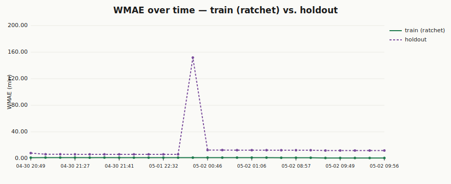
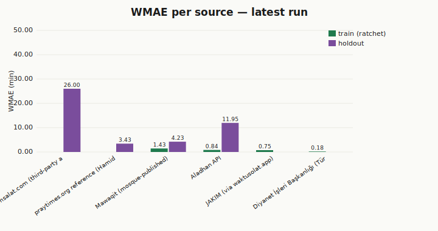
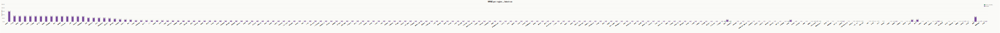
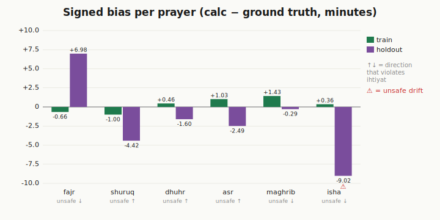
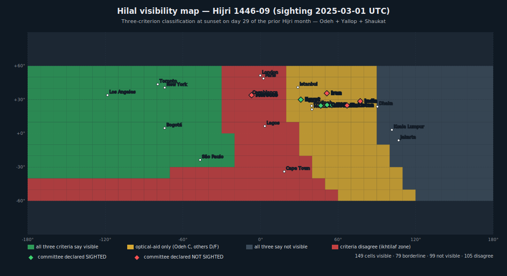
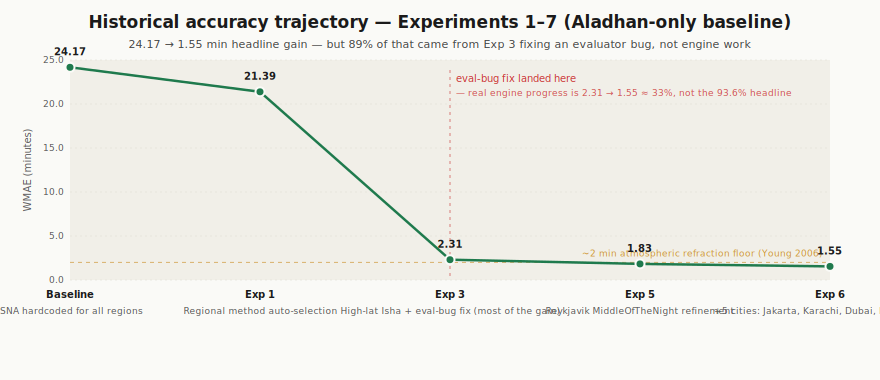

# fajr فجر

[](https://github.com/tawfeeqmartin/fajr/actions/workflows/test.yml)
[](https://www.npmjs.com/package/@tawfeeqmartin/fajr)
[](LICENSE)

> **A region-aware auto-configuration layer over [`adhan.js`](https://github.com/batoulapps/adhan-js), plus an evolving accuracy-research framework.** Fajr picks the right calculation method for your coordinates automatically, ships a small set of community-calibrated regional adjustments not in adhan's defaults (Morocco 19°/17°, France UOIF 12°/12°, high-latitude rule selection), adds **hilal (lunar crescent) visibility prediction via three criteria computed side-by-side — Odeh (2004), Yallop (1997), and Shaukat (2002)** (adhan is solar-only — fajr ships its own Meeus-based lunar position stack, validated 5/5 astronomically defensible against documented Hijri month transitions, with `criteriaAgree` flagging borderline ikhtilaf cases when any of the three disagrees), and runs an autoresearch loop that validates engine changes against multiple independent reference layers — mosque-published times (Mawaqit), institutional tables (Diyanet, JAKIM), and regional-method consensus (Aladhan, praytimes.org). Currently spans 20+ cities and 15+ countries. The eval framework, plus the hilal/lunar implementation, is where most of fajr's distinctive engineering lives today.

> **Status — v1.0.** Public API surfaces (prayerTimes, hilalVisibility, qibla, hijri, nightThirds, travelerMode) are stable; breaking changes will require a major version bump. See [API stability](#api-stability) below. Live numbers and per-source breakdown are auto-generated in [`docs/progress.md`](docs/progress.md) on every `npm run build:charts`.

---

## Why "Fajr"?

**Fajr (فجر)** means *dawn* in Arabic — the pre-dawn prayer whose accuracy depends most on the very problems this library aims to solve.

It is the prayer **most affected by the open questions this library addresses**:

- The **twilight angle debate** (15° vs 18° for true dawn — a difference of 10–20 minutes)
- **Atmospheric refraction** variations at extreme altitudes and latitudes
- **Elevation effects** on the horizon — a mosque at 2,000m sees dawn earlier than one in a valley
- **Light pollution** distorting the visual threshold in urban areas

While named after one prayer, **fajr handles all six prayer times** — Fajr, Shuruq, Dhuhr, Asr, Maghrib, Isha — plus Qibla direction (great-circle), Hijri calendar (Kuwaiti tabular algorithm), hilal (crescent) visibility prediction via the Odeh (2004) criterion (5/5 astronomically-defensible on validation cases — see [`scripts/validate-hilal.js`](scripts/validate-hilal.js)), night-thirds calculation, and traveler-mode metadata (qasr / jam' permissibility by madhab — fajr does not determine traveler status, that's left to the user). Just as `adhan.js` is named after the call to prayer but calculates all prayer times, `fajr` is named after the prayer that makes precision matter most.

The name also grounds the project in the Islamic tradition: each day begins at Fajr, and the precision of that moment is what this library is trying to improve.

---

## Architecture

```
┌─────────────────────────────────────────────────────────┐
│                    FAJR ARCHITECTURE                     │
│                                                          │
│  ┌───────────────────┐     ┌──────────────────────────┐ │
│  │  KNOWLEDGE BASE   │◄───►│    AUTORESEARCH LOOP     │ │
│  │                   │     │                           │ │
│  │  raw/ → wiki/     │     │  engine.js ──► eval.js   │ │
│  │  (continuous)     │     │      ▲            │      │ │
│  │                   │     │      └── ratchet ◄─┘      │ │
│  └───────────────────┘     └──────────────────────────┘ │
│                                                          │
│  Reference layers (each tagged separately, not blended): │
│    • mosque-published reality (Mawaqit per-mosque)       │
│    • institutional ground truth (Diyanet, JAKIM)         │
│    • regional-method consensus (Aladhan, praytimes.org)  │
│    • third-party aggregator (muslimsalat — holdout only) │
│  Metric: WMAE per source + per region + per cell         │
└─────────────────────────────────────────────────────────┘
```

Fajr is built around two interlocking research loops and a stable calculation engine:

- **Knowledge Base Loop** — raw sources (papers, fatwas, timetables) compiled into a structured wiki via `knowledge/compile.md`. Human-driven and continuous.
- **AutoResearch Loop** — agent-driven batch loop: read `src/engine.js` + wiki → propose correction → evaluate WMAE → ratchet-commit only if WMAE strictly decreases. Karpathy-inspired two-loop architecture.

Every change passes a **3-layer code review pipeline**:
1. **Automated lint** — Bismillah headers, no hardcoded angles, no per-prayer regression, scholarly classification present, wiki citation present
2. **AI code review** — security, correctness, maintainability, Islamic principle compliance, plain-English summary
3. **Human review** — judgment on Islamic principle and product direction only; implementation quality is covered by layers 1 and 2

**WMAE** = Weighted Mean Absolute Error, computed against each reference source separately and reported per-source. Fajr and Isha carry higher weights. The ratchet is judged on the train aggregate plus per-source and per-(city,source) cell no-regression rules; holdout sources are reported but never optimized against.

---

## Current Accuracy

Live, per-source numbers are auto-generated in [`docs/progress.md`](docs/progress.md). The static figures below are from the original Experiment-7 narrative (Aladhan-only) and are preserved for historical context.

### Historical baseline (Experiment 7, regional-method consensus only)

| Metric | Value |
|--------|-------|
| WMAE | **1.55 minutes** |
| Improvement from baseline | **93.6%** (from 24.17 min) — see caveat below |
| Reference points | **222** (Aladhan API only — calc-vs-calc) |
| Cities | **18** across 15 countries |
| Experiments run | 7 (5 committed, 1 reverted, 1 research) |

> **Honest caveat on the 93.6%.** Most of that gain came from Experiment 3, which fixed a post-midnight Isha day-rollover bug *in the evaluator*, not the engine. Against a correctly-measured baseline, real engine progress is closer to **2.31 → 1.55 ≈ 33%**. The 24.17 → 2.31 collapse looked like progress only because the broken evaluator was double-counting some Isha errors as ~24-hour misalignments. See `autoresearch/logs/` for the full trail.

> **Honest caveat on "ground truth".** The 222-point Experiment-7 dataset is Aladhan API output computed via the same regional methods the engine auto-detects. Agreeing with it is a *consistency check against another implementation* (regional-method consensus) — not an accuracy claim against observed prayer times. Today's evaluation adds non-Aladhan sources (Diyanet's official Türkiye tables, JAKIM via waktusolat.app, mosque-published Mawaqit times, an independent praytimes.org reference) so per-source agreement now reflects multiple distinct reference layers, not just Aladhan-internal consistency.

### Per-prayer MAE (Experiment 7, regional-method consensus)

| Prayer | MAE (min) | Notes |
|--------|-----------|-------|
| Fajr | 1.32 | Down from 19.46 baseline |
| Shuruq | 1.70 | |
| Dhuhr | 0.86 | Approaches the atmospheric refraction floor (Young 2006) |
| Asr | 1.76 | |
| Maghrib | 1.93 | |
| Isha | 1.73 | Down from 87.55 baseline |

All per-prayer MAEs were below 2 minutes against the Aladhan regional-method consensus, comparable to the irreducible ±2-min uncertainty in horizon refraction documented by [Young, A.T. (2006), "Sunset science IV: Low-altitude refraction," *Astronomical Journal* 131:1930–1943] (cited and discussed in [`knowledge/wiki/astronomy/refraction.md`](knowledge/wiki/astronomy/refraction.md)). The current multi-source evaluation surfaces additional bias signal beyond the calc-vs-calc layer — see [`docs/progress.md`](docs/progress.md) for the full per-source / per-region / per-prayer breakdown updated on every `npm run build:charts`.

### Cities covered (training set)

Casablanca · Rabat · Makkah · Madinah · Riyadh · Istanbul · Ankara · Izmir · Cairo · Alexandria · London · Kuala Lumpur · Shah Alam · George Town · New York · Los Angeles · Jakarta · Karachi · Dubai · Paris · Toronto

Additional test-set cities (holdout, never optimized against): Tromsø · Reykjavik · Helsinki · Longyearbyen (Svalbard, 78°N) · Anchorage · La Paz · Bogota · Denver · Quito · Mecca · Madinah · Istanbul (cross-source) · others (10 praytimes.org reference cities)

### Multi-source validation

Accuracy is no longer measured against a single API. fajr is validated against several distinct *kinds* of references, each tagged with its publishing body so the eval surfaces — rather than blends — *ikhtilaf* (legitimate scholarly disagreement):

| Source | Reference layer | Set | Coverage |
|---|---|---|---|
| **Mawaqit** (mawaqit.net) | Mosque-published reality | holdout | Casablanca, Rabat, Marrakech, Marseille, Limoges, Mulhouse |
| **Diyanet İşleri Başkanlığı** (Türkiye) | Official institutional ground truth | train | Istanbul, Ankara, Izmir |
| **JAKIM** (Malaysia) via waktusolat.app | Official institutional ground truth | train | Kuala Lumpur, Selangor, Penang |
| **Aladhan API** | Regional-method consensus (calc-vs-calc) | train | 18 cities, region-appropriate methods |
| **praytimes.org reference** | Regional-method consensus (independent JS impl) | holdout | 10 cities |
| **muslimsalat.com** | Third-party aggregator | holdout | Karachi, Cairo, London, Dubai |

Mosque-published reality (Mawaqit) is the most grounded layer — it's what Muslims actually pray to. Institutional ground truth (Diyanet, JAKIM) is the published timetable from the relevant national authority. Regional-method consensus (Aladhan, praytimes.org) is a separate implementation of the same formulas the engine auto-detects — agreement is a consistency check, not an independent accuracy claim. Per-source agreement, per-region tables, and trend charts are auto-generated in [`docs/progress.md`](docs/progress.md) on every `npm run build:charts`.

---

## Latest Results

_Auto-generated from `eval/results/runs.jsonl`. To refresh: `node eval/eval.js && npm run build:charts`._

For full numbers including per-region and per-cell granularity, see [**`docs/progress.md`**](docs/progress.md).









The signed-bias chart is the *ihtiyat* (precaution) view: the unsafe direction is marked on each prayer's x-axis label. Fajr/Maghrib/Isha drifting earlier (negative bias) cuts into prayer time; Shuruq drifting later extends Fajr past actual sunrise. The ratchet rejects any change that worsens these biases by more than 0.30 minutes.

### Hilal world disagreement map — Ramadan 1446 (with committee overlays)



Three-criterion (Odeh / Yallop / Shaukat) hilal visibility evaluated at every cell of a 10° lat/lng grid for Hijri 1446-09 (Ramadan 1446, sighting evening 28 February 2025), with **green diamonds** marking countries whose committees declared *sighted* and **red diamonds** marking countries that declared *not sighted*. Cell colors: green = all three criteria say visible; grey = all three say not visible; amber = "optical aid only" (Odeh C, others D/F); **red cells = full ikhtilaf zones** where the criteria disagree on visible vs not visible.

For Ramadan 1446, the red ikhtilaf zone covered ~24% of the world's surface. The **8 documented committee decisions for that month** — Saudi Arabia / UAE / Qatar / Egypt declaring sighted, Pakistan / Morocco / Iran / India declaring not sighted — sit along the predicted boundary in this single example. That's *illustrative* of the pattern, not statistical evidence for it. A larger historical sample (the Hijri 1430-onward backfill of `eval/data/hilal-observations.json` listed on the roadmap — ~15 years × 12 months × ~10 committees) is what would actually test whether the correlation holds at scale. For now: a striking single-case alignment that the multi-criterion machinery makes legible, not a published empirical result.

Regenerate for any Hijri month with `npm run build:hilal-map -- --year YEAR --month MONTH`. Committee decisions are loaded from [`eval/data/hilal-observations.json`](eval/data/hilal-observations.json); pass `--no-observations` to render without overlays.

### Hilal year-cycle animation — Hijri 1446



Cycles all 12 months of Hijri 1446 at 1 second per month (12-second loop). Watch the world swing between months where everything is visible (Safar, Rabi' al-Awwal — moon old and easy) and months where nothing is visible globally (Sha'ban — moon below Danjon everywhere). The map static-renders the first frame (Muharram) in viewers that suppress SMIL animation. Generate for any year with `npm run build:hilal-year -- --year YEAR`.

| Month (Hijri 1446) | Visible cells | Disagree cells |
|---|---:|---:|
| Muharram | 181 | 112 |
| Safar | 362 | 70 |
| Rabi' al-Awwal | 385 | 47 |
| Rabi' al-Thani | 140 | 149 |
| Jumada al-Awwal | 246 | 151 |
| Jumada al-Thani | 47 | 98 |
| Rajab | 193 | 109 |
| Sha'ban | **0** | 46 |
| Ramadan | 149 | 105 |
| Shawwal | 15 | 85 |
| Dhu al-Qi'dah | 232 | 126 |
| Dhu al-Hijjah | 139 | 106 |

---

## Experiment History

| # | Name | WMAE | Status |
|---|------|------|--------|
| 0 | Baseline (ISNA hardcoded all regions) | 24.17 min | baseline |
| 1 | Regional method auto-selection | 21.39 min | ✅ committed |
| 2 | Fajr calibration and method refinement | 21.39 min | ✅ committed |
| 3 | High-latitude Isha fix + eval day-rollover bug | 2.31 min | ✅ committed |
| 4 | Elevation corrections (Shuruq/Maghrib) | 2.99 min | ⏪ reverted |
| 5 | Reykjavik Isha refinement (Iceland→MiddleOfTheNight) | 1.83 min | ✅ committed |
| 6 | Add 5 more cities (Jakarta, Karachi, Dubai, Paris, Toronto) | 1.55 min | ✅ committed |
| 7 | Elevation USNO validation (research only) | 1.55 min | 🔬 research |

### Key findings

**Experiment 3 breakthrough:** Fixing a post-midnight Isha day-rollover bug in the evaluator (not the engine) collapsed WMAE from 21.39 to 2.31 — an 89% drop. The bug masked the true accuracy of the engine.

**Experiment 4 (reverted):** Geometric horizon dip correction for elevated cities is *physically correct* but *diverges from ground truth* because both USNO and Aladhan define sunrise/sunset relative to the sea-level horizon. The formula is validated; the question is whether the ground truth should include elevation.

**Elevation correction — validated, pending application:** The formula `arccos(R / (R + h)) × 4/cos(φ)` minutes is geometrically correct and confirmed by USNO API comparison (Δ = 0 between USNO at elevation and sea level — USNO uses sea-level convention by definition). Islamic scholarly precedent: UAE Grand Mufti issued a floor-stratified fatwa for the Burj Khalifa (IACAD Dulook DXB app); Malaysia's JAKIM applies topographic elevation correction systematically. Classification: 🟡→🟢 *Approaching established*. The correction is **disabled** in the current engine pending availability of elevation-corrected ground truth from a primary source.

---

## How Fajr Works

### Built on `adhan.js`, not a replacement

Fajr is a thin layer over [adhan.js](https://github.com/batoulapps/adhan-js) — a widely used and well-regarded Islamic prayer time calculation library by Batoul Apps. The astronomical core (sun position, refraction, sunrise/sunset, twilight angles) is adhan's; fajr does not reimplement any of that. What fajr adds is honestly small and specific:

- **Auto-detects the right adhan calculation method** for your coordinates so you don't have to configure it per region. (UX, not new accuracy — adhan already implements every method fajr selects from.)
- **Two custom angle configs not in adhan's defaults:** Morocco 19°/17° (community-calibrated to match Habous-published Imsakiyya — confirmed against Mawaqit mosque-published times) and France UOIF 12°/12°.
- **Region-appropriate high-latitude rule selection** for Norway / Iceland / Finland.
- **Optional elevation correction utility** (currently disabled by default; see [the contested-correction case study](#case-study-handling-a-contested-correction-elevation) below).
- **Hilal (lunar crescent) visibility prediction** via three independent criteria computed side-by-side: **Odeh (2004)** and **Yallop (1997)** as polynomial fits on shared (ARCV, W) inputs, plus **Shaukat (2002)** as a rule-based check on a different feature set (geocentric elongation, lag, moon age, moon altitude at sunset — Pakistan Ruet-e-Hilal practice). adhan is solar-only and does not compute lunar position; fajr ships a Meeus-based lunar position implementation (`src/lunar.js`, validated against NASA JPL Horizons DE441 ephemeris within 156″ RA / 60″ Dec / 0.03% distance — see [`docs/lunar-jpl-validation.md`](docs/lunar-jpl-validation.md)) plus all three classification logics. Returns Odeh A/B/C/D, Yallop A/B/C/D/E/F, Shaukat A/B/D, and a `criteriaAgree` flag highlighting borderline cases where any criterion disagrees with the others. Validates 5/5 astronomically defensible against documented Hijri month transitions ([`scripts/validate-hilal.js`](scripts/validate-hilal.js)). Different criteria reflect different national authorities (Odeh: Egypt, ICOP; Yallop: UK NAO; Shaukat: Pakistan), so a downstream app can match the user's own region without fajr itself pinning to one institutional choice. fajr returns astronomical possibility, not a religious ruling — the wasail/ibadat distinction is explicit. See [`knowledge/wiki/astronomy/hilal.md`](knowledge/wiki/astronomy/hilal.md).

For prayer-time calculation specifically, raw adhan.js produces the same numbers fajr does (if you already know your region's correct method). The two genuine fajr additions are the lunar/hilal stack and the Morocco custom angle. The real distinctive work is one level up: fajr ships an **evaluation methodology** that measures the engine against multiple independent reference layers separately (rather than blending them into a single "ground truth"), and a **ratchet** that refuses to accept changes which improve one source by sacrificing another. That eval framework is described below.

### Auto-detects the right method for your region

```js
// Morocco → Ministry of Habous 18°/17°
// Saudi Arabia → Umm al-Qura
// Turkey → Diyanet
// Egypt → Egyptian General Authority of Survey
// UK → Moonsighting Committee
// Malaysia → JAKIM
// Indonesia → JAKIM 20°/18°
// Pakistan → University of Islamic Sciences Karachi 18°/18°
// UAE → Umm al-Qura
// France → UOIF 12°/12°
// Canada → ISNA
// Norway / Iceland → MiddleOfTheNight high-latitude rule
// Finland → TwilightAngle high-latitude rule
fajr.prayerTimes({ latitude, longitude, date, elevation })
```

### Validated across distinct reference layers

The engine is evaluated against multiple kinds of references in parallel, each tagged separately so per-source agreement is reported without blending:

- **mosque-published reality** — Mawaqit per-mosque times (what real Moroccan / French / UK mosques actually print on their displays today)
- **institutional ground truth** — Diyanet İşleri Başkanlığı's official Türkiye tables, JAKIM via waktusolat.app for Malaysia
- **regional-method consensus** — Aladhan API (a separate implementation of the same regional methods the engine auto-detects; agreement is calc-vs-calc, not an accuracy claim against observed times) and the praytimes.org reference library (independent JS implementation of the standard formulas)
- **third-party aggregator** — muslimsalat.com (holdout only)

The eval is split into a *train* set (drives the ratchet) and a *test* holdout (reported but never optimized against — detects overfitting). The eval harness is write-protected: the autoresearch loop cannot modify `eval/` or `eval/data/` to make itself look better.

### Ratchet-based improvement

Mechanically enforced by `eval/compare.js`. A change is committed only if **all** of:

- Train WMAE strictly decreases (a wash is a rejection)
- No source's per-source WMAE worsens by >0.10 min
- No (city, source) cell worsens by >0.10 min
- No per-prayer signed bias drifts in the prayer-only-unsafe direction by >0.30 min — *unless* an independent source's per-source \|bias\| improves by ≥ max(2·\|drift\|, 1.0 min), in which case the drift is treated as cross-validated (Path A; how today's Morocco fix passed). See the [Ihtiyat dual-polarity discussion in CLAUDE.md](CLAUDE.md#islamic-accuracy-principles).

Holdout (test) WMAE is reported but never gates the decision.

### Case study: handling a contested correction (elevation)

Elevation is the cleanest worked example of how fajr reasons about a correction where the math, the prevailing convention, and the scholarly tradition do not all agree. The pieces:

- **The math says yes.** Geometric horizon dip at altitude h is `arccos(R / (R + h)) × 4/cos(φ)` minutes — pure spherical geometry, in Meeus and every astronomy textbook. ~4 min at 828m (Burj Khalifa), ~8 min at 3,640m (La Paz). Formula validated against USNO API (Δ ≈ 0 between USNO-at-elevation and USNO-at-sea-level — USNO defines sunrise relative to a sea-level horizon by convention, so the API doesn't apply the dip).
- **Prevailing convention says no.** Aladhan API and USNO both publish sea-level sunrise/sunset by definition. If fajr applied the dip, it would diverge from those references — and from most calculator apps Muslims use today.
- **Scholarly tradition is split, with documented institutional positions on both sides:**
  - 🟢 *Apply it:* UAE Grand Mufti Dr. Ahmed Al Haddad issued a floor-stratified fatwa for the Burj Khalifa, implemented in the IACAD Dulook DXB app. Malaysia's JAKIM applies topographic elevation correction systematically across the country.
  - 🟢 *Deliberately do not apply it:* Saudi Arabia under Umm al-Qura prioritises *jama'ah* (congregational unity) over geographic precision and explicitly does not apply elevation correction even in mountainous regions.
- **fajr's call:** ship the formula as an exported utility (`applyElevationCorrection`), tagged 🟡→🟢 (Approaching established), **disabled by default** so the engine matches whatever ground truth the user is comparing against — and turn it on once a primary-source timetable that *also* applies elevation enters the corpus, so engine and ground truth align.

This is the wasail/ibadat principle as code: the math is correct (wasail), but the *shar'i* application is contested, so fajr neither imposes the correction silently nor ignores it — it surfaces the disagreement, classifies it explicitly, and gates deployment on alignment between engine behaviour and the ground truth the user actually compares against. Most prayer-time libraries don't model this kind of disagreement at all.

### Scholarly oversight classification

Every correction in `src/engine.js` is tagged:

- 🟢 **Established** — consensus in Islamic astronomy, well-documented in classical sources
- 🟡→🟢 **Approaching established** — recently documented by one or more regional institutions; trajectory toward consensus
- 🟡 **Limited precedent** — supported by some scholars/institutions, minority scholarly view
- 🔴 **Novel** — requires Islamic scholarly review before relying upon

---

## Historical Results (Experiment 1–7 narrative)

The original autoresearch narrative ran against an Aladhan-only baseline (~222 ground-truth points across 18 cities) before today's multi-source eval framework. The trajectory below shows the WMAE progression from that era — preserved for context, with the eval-bug-fix inflection honestly marked.



The 24.17 → 1.55 min headline reduction looks dramatic, but **most of the gain (Exp 1 → Exp 3) was fixing an evaluator bug, not engine work.** Real engine progress against a correctly-measured baseline is closer to 2.31 → 1.55 ≈ 33%. The remaining per-city, per-prayer, and elevation-correction visualisations from the Experiment-7 narrative are now superseded by the live tables in [`docs/progress.md`](docs/progress.md) and the [Latest Results](#latest-results) section above.

---

## Quick Start

```bash
npm install @tawfeeqmartin/fajr
```

```js
import fajr from '@tawfeeqmartin/fajr'

const times = fajr.prayerTimes({
  latitude: 33.9716,
  longitude: -6.8498,
  date: new Date(),
  elevation: 75
})

console.log(times)
// {
//   fajr:    2024-03-15T04:47:00.000Z,
//   shuruq:  2024-03-15T06:14:00.000Z,
//   dhuhr:   2024-03-15T13:22:00.000Z,
//   asr:     2024-03-15T16:43:00.000Z,
//   maghrib: 2024-03-15T19:31:00.000Z,
//   isha:    2024-03-15T20:48:00.000Z,
//   method:  'Morocco (18°/17°)',
//   corrections: { elevation: true, refraction: 'standard' }
// }
```

```js
// Qibla direction
const qibla = fajr.qibla({ latitude: 33.9716, longitude: -6.8498 })

// Night thirds
const night = fajr.nightThirds({ date, latitude, longitude })

// Hijri date
const hijri = fajr.hijri(new Date())

// Hilal (lunar crescent) visibility — three criteria computed in parallel.
// Note: hilal sighting decisions are ultimately a matter of fiqh; this
// returns astronomical possibility, not a religious ruling. See
// knowledge/wiki/astronomy/hilal.md.
const hilal = fajr.hilalVisibility({ year: 1445, month: 9, latitude, longitude })

// Full return shape:
// {
//   // Odeh (2004) — primary, top-level fields preserved for back-compat.
//   visible:        true | false,
//   code:           'A' | 'B' | 'C' | 'D',
//   label:          string,
//   V:              number,         // Odeh's polynomial parameter
//   criterion:      'Odeh (2004)',
//
//   // Yallop (1997) — same (ARCV, W) inputs, different polynomial fit.
//   yallop: {
//     criterion:    'Yallop (1997)',
//     visible:      true | false,
//     code:         'A' | 'B' | 'C' | 'D' | 'E' | 'F',
//     label:        string,
//     q:            number,
//   },
//
//   // Shaukat (2002) — rule-based on a different feature set; Pakistan practice.
//   shaukat: {
//     criterion:    'Shaukat (2002)',
//     visible:      true | false,
//     code:         'A' | 'B' | 'D',
//     label:        string,
//     elongationDeg, moonAltAtSunsetDeg, moonAgeHours, lagMinutes,
//   },
//
//   // True iff all three criteria agree on the binary visible/not-visible
//   // verdict. False = borderline ikhtilaf — surface this in any UI; the
//   // sighting is contested and witness testimony / scholarly judgment matter.
//   criteriaAgree:  true | false,
//
//   // Geometry (shared between criteria).
//   arcvDeg, widthArcmin, lagTimeMinutes, moonAgeHours,
//   sunsetUTC, moonsetUTC, bestTimeUTC, conjunctionUTC,
//
//   // Hijri context.
//   evaluatedHijriDate: { year, month: 9 (= 8 + 1 — sighting eve of month 9 starts at day 29 of month 8), day: 29 },
//   forHijriMonth:      { year, month },
//   latitude, longitude,
//
//   note: '...wasail/ibadat reminder...',
// }

// Traveler mode (shortened/combined prayers)
const travelerTimes = fajr.travelerMode({ ...coords, madhab: 'hanafi' })
```

TypeScript declarations ship with the package (`src/index.d.ts`); `import` from `@tawfeeqmartin/fajr` gets full type coverage out of the box.

---

## API stability

fajr v1.0 makes the following stability promises. **Stable** surfaces will not change in non-breaking ways without a major version bump. **Experimental** surfaces may change in minor versions; they're shipped because they're useful, not because they're frozen.

### Stable (v1.0 contract)

| API | Signature |
|---|---|
| `prayerTimes` | `({ latitude, longitude, date, elevation? }) → { fajr, shuruq, dhuhr, asr, maghrib, isha, method, corrections }` |
| `qibla` | `({ latitude, longitude }) → { bearing, magneticDeclination, trueBearing }` |
| `hijri` | `(Date) → { year, month, day, monthName }` |
| `hilalVisibility` | `({ year, month, latitude, longitude }) → { visible, code, V, yallop, shaukat, criteriaAgree, … }` |
| `nightThirds` | `({ date, latitude, longitude })` *or* `({ maghrib, fajr })` → `{ firstThird, secondThird, lastThird, midnight }` |
| `travelerMode` | `({ times, madhab? }) → { qasr, jam, … }` |

The default export object exposing all six is also stable.

### Experimental (subject to change)

- `applyElevationCorrection(times, elevation, latitude?)` — opt-in geometric horizon-dip correction. Disabled by default in `prayerTimes`. May move to a separate package or change signature based on scholarly review of the 🟡→🟢 classification.
- `magneticDeclination` field on `qibla` output — currently 0 (placeholder). Will be filled with a real WMM2024 lookup in a minor version, which may shift `trueBearing` for users who relied on it being identical to `bearing`.

### Internal (not part of the public API)

- `src/lunar.js` — Meeus lunar/solar position primitives used by `hilalVisibility`. Validated against JPL Horizons but not stability-promised at the function level.
- `src/methods.js`, `src/engine.js` — implementation details of region detection / method selection. Behaviour observable through `prayerTimes`'s output is stable; the internal modules are not.
- `eval/`, `scripts/`, `knowledge/` — research framework, data, build tools. Not consumer surface.

### What "v1.0" doesn't yet mean

Honest items still on the v1.0+ roadmap:

- **External scholarly review.** Morocco's 19° community-calibrated angle, the dual-ihtiyat handling in `compare.js`, and the choice of Odeh/Yallop/Shaukat as fajr's hilal criteria are sound by fajr's own wasail/ibadat principle but have not yet been reviewed by a named scholar. Flagged in [`knowledge/wiki/astronomy/hilal.md`](knowledge/wiki/astronomy/hilal.md) "Validation status".
- **End-to-end hilal accuracy at scale.** Lunar and solar position primitives are validated against JPL Horizons DE441 (see `docs/lunar-jpl-validation.md`, `docs/solar-jpl-validation.md`); end-to-end hilal classification has only a 5-case illustrative validation. The historical-sightings backfill (~1,800 committee decisions across Hijri 1430-onward) is the path to honest empirical validation at scale.
- **Production deployment.** [agiftoftime.app](https://agiftoftime.app) integration is mapped (see [`examples/agiftoftime/INTEGRATION.md`](examples/agiftoftime/INTEGRATION.md)) but not yet shipped. Until at least one production deployment runs against fajr, "v1.0 stable" is a claim, not yet a track record.

---

## Research Foundation

### Islamic scholarly foundations

The definitions of prayer times are derived from primary Islamic sources:

- **Quran** — Surah Al-Isra 17:78, Surah Hud 11:114, Surah Ta-Ha 20:130
- **Hadith** — Jibril narrations on prayer time boundaries (Tirmidhi, Abu Dawud)
- **Classical fiqh** — Hanafi, Maliki, Shafi'i, Hanbali rulings on twilight definitions
- **Islamic astronomy tradition** — Al-Biruni, Al-Battani, Ibn al-Shatir, the *muwaqqit* (mosque timekeeper) tradition

### Institutional validation

- **UAE (Burj Khalifa fatwa)** — IACAD Dulook DXB app; floor-stratified elevation corrections, Dr. Ahmed Al Haddad
- **Malaysia (JAKIM)** — systematic topographic elevation correction applied nationally
- **USNO** — sea-level convention confirmed; sunrise/sunset identical at all elevations by definition

### Computational sources

- **[adhan.js](https://github.com/batoulapps/adhan-js)** — core solar position and prayer time engine
- **Meeus, *Astronomical Algorithms* (2nd ed.)** — horizon geometry and refraction formulas
- **USNO Astronomical Almanac** — sunrise/sunset convention reference

---

## Contributing

### Code contributions

Pull requests welcome. See `CLAUDE.md` for the autoresearch architecture and ratchet rules — the eval harness is the arbiter of accuracy improvements.

### Islamic scholarly review

This is especially needed for **🟡 and 🔴 corrections** in `src/engine.js`. If you are a scholar or researcher in Islamic astronomy (*'ilm al-miqat*), your review is invaluable. Please open an issue or contact the maintainer.

### Ground truth timetable data

The most valuable contribution is verified timetable data:
- Official government-published timetables (`knowledge/raw/timetables/`)
- Field observations with GPS coordinates and elevation (`knowledge/raw/observations/`)
- Elevation-corrected timetable data (especially needed — all current ground truth uses sea-level definitions)

---

## Wasail and Ibadat

This library improves the **wasail** (means) of determining prayer times — the astronomical and mathematical tools — not the **ibadat** (acts of worship) themselves. The definitions of prayer times are fixed by Islamic law (*shar'*); what fajr improves is the precision with which those definitions are translated into clock times at a given location.

Corrections classified 🔴 (novel) should not be relied upon for prayer until reviewed by qualified scholars.

---

## Credits

### The Islamic astronomy tradition

This library stands on the shoulders of centuries of *'ilm al-miqat* (the science of timekeeping). Scholars and muwaqqitun (mosque timekeepers) maintained astronomical observatories, produced *zij* (astronomical tables), and refined solar position calculations centuries before modern computers. Their work — Al-Biruni's *Kitab al-Qanun al-Mas'udi*, Al-Battani's *Zij*, Ibn al-Shatir's planetary models — is the intellectual foundation of Islamic prayer timekeeping.

### Modern foundations

- **[adhan.js](https://github.com/batoulapps/adhan-js)** by Batoul Apps — the prayer time calculation engine this library wraps
- **[praytimes.org](https://praytimes.org)** by Hamid Zarrabi-Zadeh — the LGPL reference implementation used for independent calc-vs-calc validation (vendored at `scripts/lib/PrayTimes.js`)

### Ground truth sources

fajr is validated against multiple institutional and community sources:

- **[Aladhan API](https://aladhan.com)** — multi-method calculator covering all train regions
- **Diyanet İşleri Başkanlığı** (Republic of Türkiye) — official Turkish prayer times via [ezanvakti.emushaf.net](https://ezanvakti.emushaf.net)
- **JAKIM** (Jabatan Kemajuan Islam Malaysia) — official Malaysian prayer times via the [waktusolat.app](https://waktusolat.app) community proxy (e-solat.gov.my is geo-restricted)
- **[muslimsalat.com](https://muslimsalat.com)** — third-party aggregator used for cross-validation
- **praytimes.org reference library** — independent JS implementation, used as a calc-vs-calc check

Muslim communities and institutions worldwide who publish official timetables and make them freely available — *jazakum Allah khayran*.

### Refreshing the corpus

```bash
npm run fetch:all       # refetch every source's fixtures
npm run eval            # measure current WMAE per source
npm run build:charts    # regenerate docs/progress.md and SVG charts
```

To add a new source: write `scripts/fetch-<name>.js` following the existing adapters' pattern (each fixture must include `source_institution`, `source_method`, `source_url`, `source_fetched`). Place output in `eval/data/train/` for institutional/regional sources or `eval/data/test/` for cross-validation/holdout.

---

## License

MIT © Tawfeeq Martin

*"Indeed, the prayer has been decreed upon the believers a decree of specified times."* — Quran 4:103

---

> **Fajr** (فجر) is a sadaqah jariyah dedicated to my daughters Nurjaan and Kauthar.
>
> It began with [A Gift of Time](https://agiftoftime.app) — a study in light, time, orientation and a call to prayer, built with Kauthar — and a simple question: how do we know these times are right? That question led here.
