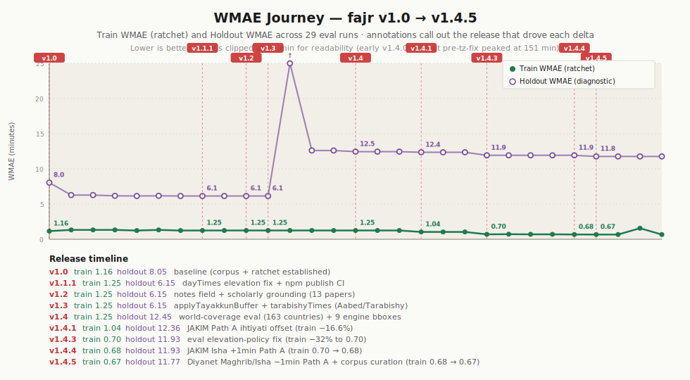

# fajr فجر

[](https://github.com/tawfeeqmartin/fajr/actions/workflows/test.yml)
[](https://www.npmjs.com/package/@tawfeeqmartin/fajr)
[](LICENSE)

> **A region-aware auto-configuration layer over [`adhan.js`](https://github.com/batoulapps/adhan-js), plus an evolving accuracy-research framework.** Fajr picks the right calculation method for your coordinates automatically, ships a small set of community-calibrated regional adjustments not in adhan's defaults (Morocco 19°/17°, France UOIF 12°/12°, high-latitude rule selection), adds **hilal (lunar crescent) visibility prediction via three criteria computed side-by-side — Odeh (2004), Yallop (1997), and Shaukat (2002)** (adhan is solar-only — fajr ships its own Meeus-based lunar position stack, validated 5/5 astronomically defensible against documented Hijri month transitions, with `criteriaAgree` flagging borderline ikhtilaf cases when any of the three disagrees), and runs an autoresearch loop that validates engine changes against multiple independent reference layers — mosque-published times (Mawaqit), institutional tables (Diyanet, JAKIM), and regional-method consensus (Aladhan, praytimes.org). Currently spans 20+ cities and 15+ countries. The eval framework, plus the hilal/lunar implementation, is where most of fajr's distinctive engineering lives today.

> **Status — v1.5.** Public API surfaces (`prayerTimes`, `dayTimes`, `tarabishyTimes`, `applyElevationCorrection`, `applyTayakkunBuffer`, `hilalVisibility`, `qibla`, `hijri`, `nightThirds`, `travelerMode`) are stable; breaking changes will require a major version bump. v1.5.2 added an **elevation advisory** at altitudes ≥ 500 m surfacing the UAE/JAKIM-vs-Saudi institutional disagreement so apps can present the user with an informed choice — see [Elevation advisory at significant altitude](#elevation-advisory-at-significant-altitude-v152). v1.5.1 introduced **per-prayer ihtiyat-aware minute rounding** (every displayed minute is on the prayer-validity-safe side of actual reality, by construction) and an explicit **`imsak`** field for fasting-yaqeen — see the principle table in [Per-prayer ihtiyat-aware minute rounding](#per-prayer-ihtiyat-aware-minute-rounding-v151). v1.5.0 shipped the Morocco Maghrib +5min Path A across 23 mosques. v1.3 added the Aabed-2015 tayakkun buffer and Tarabishy-2014 latitude-truncation method as opt-in alternatives, plus a `notes: string[]` field on `prayerTimes` output that surfaces scholarly-grounded location-specific advisories (currently the Odeh-2009 high-latitude regime warning at \|lat\| ≥ 48.6°). See [API stability](#api-stability) below. Live numbers and per-source breakdown are auto-generated in [`docs/progress.md`](docs/progress.md) on every `npm run build:charts`.

---

## Why "Fajr"?

**Fajr (فجر)** means *dawn* in Arabic — the pre-dawn prayer whose accuracy depends most on the very problems this library aims to solve.

It is the prayer **most affected by the open questions this library addresses**:

- The **twilight angle debate** (15° vs 18° for true dawn — a difference of 10–20 minutes)
- **Atmospheric refraction** variations at extreme altitudes and latitudes
- **Elevation effects** on the horizon — a mosque at 2,000m sees dawn earlier than one in a valley
- **Light pollution** distorting the visual threshold in urban areas

While named after one prayer, **fajr handles all six prayer times** — Fajr, Shuruq, Dhuhr, Asr, Maghrib, Isha — plus astronomical Sunrise / Sunset distinct from Maghrib, single-call `dayTimes()` for the 9-field bundle (six prayers + sunrise + sunset + midnight + qiyam start), Qibla direction (great-circle), Hijri calendar (Kuwaiti tabular algorithm), three-criterion hilal (crescent) visibility prediction (Odeh 2004 + Yallop 1997 + Shaukat 2002 computed side-by-side, with `criteriaAgree` flagging borderline ikhtilaf — see [`scripts/validate-hilal.js`](scripts/validate-hilal.js)), night-thirds calculation, traveler-mode metadata (qasr / jam' permissibility by madhab — fajr does not determine traveler status, that's left to the user), and opt-in scholarly corrections: `applyElevationCorrection` (geometric horizon-dip per Burj Khalifa fatwa / Malaysia JAKIM), `applyTayakkunBuffer` (Aabed-2015 5-min Fajr buffer for naked-eye certainty), and `tarabishyTimes` (Tarabishy-2014 45° latitude-truncation alternative to the default high-latitude rule). Just as `adhan.js` is named after the call to prayer but calculates all prayer times, `fajr` is named after the prayer that makes precision matter most.

The name also grounds the project in the Islamic tradition: each day begins at Fajr, and the precision of that moment is what this library is trying to improve.

---

## Architecture

```
┌─────────────────────────────────────────────────────────┐
│                    FAJR ARCHITECTURE                     │
│                                                          │
│  ┌───────────────────┐     ┌──────────────────────────┐ │
│  │  KNOWLEDGE BASE   │◄───►│    AUTORESEARCH LOOP     │ │
│  │                   │     │                           │ │
│  │  raw/ → wiki/     │     │  engine.js ──► eval.js   │ │
│  │  (continuous)     │     │      ▲            │      │ │
│  │                   │     │      └── ratchet ◄─┘      │ │
│  └───────────────────┘     └──────────────────────────┘ │
│                                                          │
│  Reference layers (each tagged separately, not blended): │
│    • mosque-published reality (Mawaqit per-mosque)       │
│    • institutional ground truth (Diyanet, JAKIM)         │
│    • regional-method consensus (Aladhan, praytimes.org)  │
│    • third-party aggregator (muslimsalat — holdout only) │
│  Metric: WMAE per source + per region + per cell         │
└─────────────────────────────────────────────────────────┘
```

Fajr is built around two interlocking research loops and a stable calculation engine:

- **Knowledge Base Loop** — raw sources (papers, fatwas, timetables) compiled into a structured wiki via `knowledge/compile.md`. Human-driven and continuous.
- **AutoResearch Loop** — agent-driven batch loop: read `src/engine.js` + wiki → propose correction → evaluate WMAE → ratchet-commit only if WMAE strictly decreases. Karpathy-inspired two-loop architecture.

Every change passes a **3-layer code review pipeline**:
1. **Automated lint** — Bismillah headers, no hardcoded angles, no per-prayer regression, scholarly classification present, wiki citation present
2. **AI code review** — security, correctness, maintainability, Islamic principle compliance, plain-English summary
3. **Human review** — judgment on Islamic principle and product direction only; implementation quality is covered by layers 1 and 2

**WMAE** = Weighted Mean Absolute Error, computed against each reference source separately and reported per-source. Fajr and Isha carry higher weights. The ratchet is judged on the train aggregate plus per-source and per-(city,source) cell no-regression rules; holdout sources are reported but never optimized against.

---

## Current Accuracy

Live, per-source numbers are auto-generated in [`docs/progress.md`](docs/progress.md). The static figures below are from the original Experiment-7 narrative (Aladhan-only) and are preserved for historical context.

### Historical baseline (Experiment 7, regional-method consensus only)

| Metric | Value |
|--------|-------|
| WMAE | **1.55 minutes** |
| Improvement from baseline | **93.6%** (from 24.17 min) — see caveat below |
| Reference points | **222** (Aladhan API only — calc-vs-calc) |
| Cities | **18** across 15 countries |
| Experiments run | 7 (5 committed, 1 reverted, 1 research) |

> **Honest caveat on the 93.6%.** Most of that gain came from Experiment 3, which fixed a post-midnight Isha day-rollover bug *in the evaluator*, not the engine. Against a correctly-measured baseline, real engine progress is closer to **2.31 → 1.55 ≈ 33%**. The 24.17 → 2.31 collapse looked like progress only because the broken evaluator was double-counting some Isha errors as ~24-hour misalignments. See `autoresearch/logs/` for the full trail.

> **Honest caveat on "ground truth".** The 222-point Experiment-7 dataset is Aladhan API output computed via the same regional methods the engine auto-detects. Agreeing with it is a *consistency check against another implementation* (regional-method consensus) — not an accuracy claim against observed prayer times. Today's evaluation adds non-Aladhan sources (Diyanet's official Türkiye tables, JAKIM via waktusolat.app, mosque-published Mawaqit times, an independent praytimes.org reference) so per-source agreement now reflects multiple distinct reference layers, not just Aladhan-internal consistency.

### Per-prayer MAE (Experiment 7, regional-method consensus)

| Prayer | MAE (min) | Notes |
|--------|-----------|-------|
| Fajr | 1.32 | Down from 19.46 baseline |
| Shuruq | 1.70 | |
| Dhuhr | 0.86 | Approaches the atmospheric refraction floor (Young 2006) |
| Asr | 1.76 | |
| Maghrib | 1.93 | |
| Isha | 1.73 | Down from 87.55 baseline |

All per-prayer MAEs were below 2 minutes against the Aladhan regional-method consensus, comparable to the irreducible ±2-min uncertainty in horizon refraction documented by [Young, A.T. (2006), "Sunset science IV: Low-altitude refraction," *Astronomical Journal* 131:1930–1943] (cited and discussed in [`knowledge/wiki/astronomy/refraction.md`](knowledge/wiki/astronomy/refraction.md)). The current multi-source evaluation surfaces additional bias signal beyond the calc-vs-calc layer — see [`docs/progress.md`](docs/progress.md) for the full per-source / per-region / per-prayer breakdown updated on every `npm run build:charts`.

### Cities covered (training set)

Casablanca · Rabat · Makkah · Madinah · Riyadh · Istanbul · Ankara · Izmir · Cairo · Alexandria · London · Kuala Lumpur · Shah Alam · George Town · New York · Los Angeles · Jakarta · Karachi · Dubai · Paris · Toronto

Additional test-set cities (holdout, never optimized against): Tromsø · Reykjavik · Helsinki · Longyearbyen (Svalbard, 78°N) · Anchorage · La Paz · Bogota · Denver · Quito · Mecca · Madinah · Istanbul (cross-source) · others (10 praytimes.org reference cities)

### Multi-source validation

Accuracy is no longer measured against a single API. fajr is validated against several distinct *kinds* of references, each tagged with its publishing body so the eval surfaces — rather than blends — *ikhtilaf* (legitimate scholarly disagreement):

| Source | Reference layer | Set | Coverage |
|---|---|---|---|
| **Mawaqit** (mawaqit.net) | Mosque-published reality | holdout | Casablanca, Rabat, Marrakech, Marseille, Limoges, Mulhouse |
| **Diyanet İşleri Başkanlığı** (Türkiye) | Official institutional ground truth | train | Istanbul, Ankara, Izmir |
| **JAKIM** (Malaysia) via waktusolat.app | Official institutional ground truth | train | Kuala Lumpur, Selangor, Penang |
| **Aladhan API** | Regional-method consensus (calc-vs-calc) | train | 18 cities, region-appropriate methods |
| **praytimes.org reference** | Regional-method consensus (independent JS impl) | holdout | 10 cities |
| **muslimsalat.com** | Third-party aggregator | holdout | Karachi, Cairo, London, Dubai |

Mosque-published reality (Mawaqit) is the most grounded layer — it's what Muslims actually pray to. Institutional ground truth (Diyanet, JAKIM) is the published timetable from the relevant national authority. Regional-method consensus (Aladhan, praytimes.org) is a separate implementation of the same formulas the engine auto-detects — agreement is a consistency check, not an independent accuracy claim. Per-source agreement, per-region tables, and trend charts are auto-generated in [`docs/progress.md`](docs/progress.md) on every `npm run build:charts`.

---

## Latest Results

_Auto-generated from `eval/results/runs.jsonl`. To refresh: `node eval/eval.js && npm run build:charts`._

For full numbers including per-region and per-cell granularity, see [**`docs/progress.md`**](docs/progress.md). For the per-release WMAE-improvement narrative — what each release shipped and why train WMAE moved — see the journey chart below or [`docs/calibration-recipe.md`](docs/calibration-recipe.md) for the durable methodology guide that future calibration work follows.



The journey chart annotates each tagged release with the change that drove its train- or holdout-WMAE delta. Releases that added features (notes field, opt-in correction helpers, world-coverage data) leave train WMAE flat at the ratchet level — only calibration refinements move the train number. As of v1.4.4 the train ratchet has dropped from the v1.0 baseline of 1.16 → **0.68** via three accuracy releases: v1.4.1 (JAKIM Fajr +8min Path A, train −16.6%), v1.4.3 (eval elevation-policy fix removing phantom artifacts, train −32%), and v1.4.4 (JAKIM Isha +1min Path A, train −3.2%). The v1.4 holdout climb reflects the eval-corpus widening to 163 country fixtures, not an engine regression. See [`docs/calibration-recipe.md`](docs/calibration-recipe.md) for the methodology behind each Path A correction.


The signed-bias chart is the *ihtiyat* (precaution) view: the unsafe direction is marked on each prayer's x-axis label. Fajr/Maghrib/Isha drifting earlier (negative bias) cuts into prayer time; Shuruq drifting later extends Fajr past actual sunrise. The ratchet rejects any change that worsens these biases by more than 0.30 minutes.

### Hilal world disagreement map — Ramadan 1446 (with committee overlays)


Three-criterion (Odeh / Yallop / Shaukat) hilal visibility evaluated at every cell of a 10° lat/lng grid for Hijri 1446-09 (Ramadan 1446, sighting evening 28 February 2025), with **green diamonds** marking countries whose committees declared *sighted* and **red diamonds** marking countries that declared *not sighted*. Cell colors: green = all three criteria say visible; grey = all three say not visible; amber = "optical aid only" (Odeh C, others D/F); **red cells = full ikhtilaf zones** where the criteria disagree on visible vs not visible.

For Ramadan 1446, the red ikhtilaf zone covered ~24% of the world's surface. The **8 documented committee decisions for that month** — Saudi Arabia / UAE / Qatar / Egypt declaring sighted, Pakistan / Morocco / Iran / India declaring not sighted — sit along the predicted boundary in this single example. That's *illustrative* of the pattern, not statistical evidence for it. A larger historical sample (the Hijri 1430-onward backfill of `eval/data/hilal-observations.json` listed on the roadmap — ~15 years × 12 months × ~10 committees) is what would actually test whether the correlation holds at scale. For now: a striking single-case alignment that the multi-criterion machinery makes legible, not a published empirical result.

Regenerate for any Hijri month with `npm run build:hilal-map -- --year YEAR --month MONTH`. Committee decisions are loaded from [`eval/data/hilal-observations.json`](eval/data/hilal-observations.json); pass `--no-observations` to render without overlays.

### Hilal year-cycle animation — Hijri 1446


Cycles all 12 months of Hijri 1446 at 1 second per month (12-second loop). Watch the world swing between months where everything is visible (Safar, Rabi' al-Awwal — moon old and easy) and months where nothing is visible globally (Sha'ban — moon below Danjon everywhere). The map static-renders the first frame (Muharram) in viewers that suppress SMIL animation. Generate for any year with `npm run build:hilal-year -- --year YEAR`.

| Month (Hijri 1446) | Visible cells | Disagree cells |
|---|---:|---:|
| Muharram | 181 | 112 |
| Safar | 362 | 70 |
| Rabi' al-Awwal | 385 | 47 |
| Rabi' al-Thani | 140 | 149 |
| Jumada al-Awwal | 246 | 151 |
| Jumada al-Thani | 47 | 98 |
| Rajab | 193 | 109 |
| Sha'ban | **0** | 46 |
| Ramadan | 149 | 105 |
| Shawwal | 15 | 85 |
| Dhu al-Qi'dah | 232 | 126 |
| Dhu al-Hijjah | 139 | 106 |

---

## Experiment History

| # | Name | WMAE | Status |
|---|------|------|--------|
| 0 | Baseline (ISNA hardcoded all regions) | 24.17 min | baseline |
| 1 | Regional method auto-selection | 21.39 min | ✅ committed |
| 2 | Fajr calibration and method refinement | 21.39 min | ✅ committed |
| 3 | High-latitude Isha fix + eval day-rollover bug | 2.31 min | ✅ committed |
| 4 | Elevation corrections (Shuruq/Maghrib) | 2.99 min | ⏪ reverted |
| 5 | Reykjavik Isha refinement (Iceland→MiddleOfTheNight) | 1.83 min | ✅ committed |
| 6 | Add 5 more cities (Jakarta, Karachi, Dubai, Paris, Toronto) | 1.55 min | ✅ committed |
| 7 | Elevation USNO validation (research only) | 1.55 min | 🔬 research |

### Key findings

**Experiment 3 breakthrough:** Fixing a post-midnight Isha day-rollover bug in the evaluator (not the engine) collapsed WMAE from 21.39 to 2.31 — an 89% drop. The bug masked the true accuracy of the engine.

**Experiment 4 (reverted):** Geometric horizon dip correction for elevated cities is *physically correct* but *diverges from ground truth* because both USNO and Aladhan define sunrise/sunset relative to the sea-level horizon. The formula is validated; the question is whether the ground truth should include elevation.

**Elevation correction — validated, pending application:** The formula `arccos(R / (R + h)) × 4/cos(φ)` minutes is geometrically correct and confirmed by USNO API comparison (Δ = 0 between USNO at elevation and sea level — USNO uses sea-level convention by definition). Islamic scholarly precedent: UAE Grand Mufti issued a floor-stratified fatwa for the Burj Khalifa (IACAD Dulook DXB app); Malaysia's JAKIM applies topographic elevation correction systematically. Classification: 🟡→🟢 *Approaching established*. The correction is **disabled** in the current engine pending availability of elevation-corrected ground truth from a primary source.

---

## How Fajr Works

### Built on `adhan.js`, not a replacement

Fajr is a thin layer over [adhan.js](https://github.com/batoulapps/adhan-js) — a widely used and well-regarded Islamic prayer time calculation library by Batoul Apps. The astronomical core (sun position, refraction, sunrise/sunset, twilight angles) is adhan's; fajr does not reimplement any of that. What fajr adds is honestly small and specific:

- **Auto-detects the right adhan calculation method** for your coordinates so you don't have to configure it per region. (UX, not new accuracy — adhan already implements every method fajr selects from.)
- **Two custom angle configs not in adhan's defaults:** Morocco 19°/17° (community-calibrated to match Habous-published Imsakiyya — confirmed against Mawaqit mosque-published times) and France UOIF 12°/12°.
- **Region-appropriate high-latitude rule selection** for Norway / Iceland / Finland.
- **Optional elevation correction utility** (currently disabled by default; see [the contested-correction case study](#case-study-handling-a-contested-correction-elevation) below).
- **Hilal (lunar crescent) visibility prediction** via three independent criteria computed side-by-side: **Odeh (2004)** and **Yallop (1997)** as polynomial fits on shared (ARCV, W) inputs, plus **Shaukat (2002)** as a rule-based check on a different feature set (geocentric elongation, lag, moon age, moon altitude at sunset — Pakistan Ruet-e-Hilal practice). adhan is solar-only and does not compute lunar position; fajr ships a Meeus-based lunar position implementation (`src/lunar.js`, validated against NASA JPL Horizons DE441 ephemeris within 156″ RA / 60″ Dec / 0.03% distance — see [`docs/lunar-jpl-validation.md`](docs/lunar-jpl-validation.md)) plus all three classification logics. Returns Odeh A/B/C/D, Yallop A/B/C/D/E/F, Shaukat A/B/D, and a `criteriaAgree` flag highlighting borderline cases where any criterion disagrees with the others. Validates 5/5 astronomically defensible against documented Hijri month transitions ([`scripts/validate-hilal.js`](scripts/validate-hilal.js)). Different criteria reflect different national authorities (Odeh: Egypt, ICOP; Yallop: UK NAO; Shaukat: Pakistan), so a downstream app can match the user's own region without fajr itself pinning to one institutional choice. fajr returns astronomical possibility, not a religious ruling — the wasail/ibadat distinction is explicit. See [`knowledge/wiki/astronomy/hilal.md`](knowledge/wiki/astronomy/hilal.md).

For prayer-time calculation specifically, raw adhan.js produces the same numbers fajr does (if you already know your region's correct method). The two genuine fajr additions are the lunar/hilal stack and the Morocco custom angle. The real distinctive work is one level up: fajr ships an **evaluation methodology** that measures the engine against multiple independent reference layers separately (rather than blending them into a single "ground truth"), and a **ratchet** that refuses to accept changes which improve one source by sacrificing another. That eval framework is described below.

### Auto-detects the right method for your region

```js
// Morocco → Ministry of Habous 18°/17°
// Saudi Arabia → Umm al-Qura
// Turkey → Diyanet
// Egypt → Egyptian General Authority of Survey
// UK → Moonsighting Committee
// Malaysia → JAKIM
// Indonesia → JAKIM 20°/18°
// Pakistan → University of Islamic Sciences Karachi 18°/18°
// UAE → Umm al-Qura
// France → UOIF 12°/12°
// Canada → ISNA
// Norway / Iceland → MiddleOfTheNight high-latitude rule
// Finland → TwilightAngle high-latitude rule
fajr.prayerTimes({ latitude, longitude, date, elevation })
```

### Validated across distinct reference layers

The engine is evaluated against multiple kinds of references in parallel, each tagged separately so per-source agreement is reported without blending:

- **mosque-published reality** — Mawaqit per-mosque times (what real Moroccan / French / UK mosques actually print on their displays today)
- **institutional ground truth** — Diyanet İşleri Başkanlığı's official Türkiye tables, JAKIM via waktusolat.app for Malaysia
- **regional-method consensus** — Aladhan API (a separate implementation of the same regional methods the engine auto-detects; agreement is calc-vs-calc, not an accuracy claim against observed times) and the praytimes.org reference library (independent JS implementation of the standard formulas)
- **third-party aggregator** — muslimsalat.com (holdout only)

The eval is split into a *train* set (drives the ratchet) and a *test* holdout (reported but never optimized against — detects overfitting). The eval harness is write-protected: the autoresearch loop cannot modify `eval/` or `eval/data/` to make itself look better.

### Ratchet-based improvement

Mechanically enforced by `eval/compare.js`. A change is committed only if **all** of:

- Train WMAE strictly decreases (a wash is a rejection)
- No source's per-source WMAE worsens by >0.10 min
- No (city, source) cell worsens by >0.10 min
- No per-prayer signed bias drifts in the prayer-only-unsafe direction by >0.30 min — *unless* an independent source's per-source \|bias\| improves by ≥ max(2·\|drift\|, 1.0 min), in which case the drift is treated as cross-validated (Path A; how today's Morocco fix passed). See the [Ihtiyat dual-polarity discussion in CLAUDE.md](CLAUDE.md#islamic-accuracy-principles).

Holdout (test) WMAE is reported but never gates the decision.

### Case study: handling a contested correction (elevation)

Elevation is the cleanest worked example of how fajr reasons about a correction where the math, the prevailing convention, and the scholarly tradition do not all agree. The pieces:

- **The math says yes.** Geometric horizon dip at altitude h is `arccos(R / (R + h)) × 4/cos(φ)` minutes — pure spherical geometry, in Meeus and every astronomy textbook. ~4 min at 828m (Burj Khalifa), ~8 min at 3,640m (La Paz). Formula validated against USNO API (Δ ≈ 0 between USNO-at-elevation and USNO-at-sea-level — USNO defines sunrise relative to a sea-level horizon by convention, so the API doesn't apply the dip).
- **Prevailing convention says no.** Aladhan API and USNO both publish sea-level sunrise/sunset by definition. If fajr applied the dip, it would diverge from those references — and from most calculator apps Muslims use today.
- **Scholarly tradition is split, with documented institutional positions on both sides:**
  - 🟢 *Apply it:* UAE Grand Mufti Dr. Ahmed Al Haddad issued a floor-stratified fatwa for the Burj Khalifa, implemented in the IACAD Dulook DXB app. Malaysia's JAKIM applies topographic elevation correction systematically across the country.
  - 🟢 *Deliberately do not apply it:* Saudi Arabia under Umm al-Qura prioritises *jama'ah* (congregational unity) over geographic precision and explicitly does not apply elevation correction even in mountainous regions.
- **fajr's call:** ship the formula as an exported utility (`applyElevationCorrection`), tagged 🟡→🟢 (Approaching established), **disabled by default** so the engine matches whatever ground truth the user is comparing against — and turn it on once a primary-source timetable that *also* applies elevation enters the corpus, so engine and ground truth align.

This is the wasail/ibadat principle as code: the math is correct (wasail), but the *shar'i* application is contested, so fajr neither imposes the correction silently nor ignores it — it surfaces the disagreement, classifies it explicitly, and gates deployment on alignment between engine behaviour and the ground truth the user actually compares against. Most prayer-time libraries don't model this kind of disagreement at all.

### Scholarly oversight classification

Every correction in `src/engine.js` is tagged:

- 🟢 **Established** — consensus in Islamic astronomy, well-documented in classical sources
- 🟡→🟢 **Approaching established** — recently documented by one or more regional institutions; trajectory toward consensus
- 🟡 **Limited precedent** — supported by some scholars/institutions, minority scholarly view
- 🔴 **Novel** — requires Islamic scholarly review before relying upon

### Elevation advisory at significant altitude (v1.5.2)

GPS receivers return altitude alongside latitude and longitude. At altitudes above ~500 m, the geometric horizon dip becomes practically significant — sun rises *earlier* and sets *later* than the sea-level calculation by 2 to 6+ minutes depending on elevation. This is real and predictable; the institutional question is whether it should be applied to displayed prayer times.

**Institutional stances differ:**

- **UAE (Burj Khalifa fatwa, IACAD Dulook DXB)** — applies floor-stratified prayer times; institutional acknowledgement that observers at altitude see the horizon differently.
- **Malaysia JAKIM** — applies topographic elevation correction systematically across the country.
- **Saudi Arabia / Umm al-Qura** — explicitly *declines* the correction. Reasoning: jama'ah unity. A high-rise resident in Riyadh praying with their floor's correction would pray a different time than the rest of the city, fragmenting the congregation. Saudi prioritises uniform community time over per-observer geometric accuracy.

These are competing valid stances and fajr does not pick one for the user — but it does inform them. **When the caller passes `elevation ≥ 500 m`, fajr emits a `notes[]` advisory describing the elevation, the magnitude of the shift, and which institutions apply vs decline the correction.** Apps can render the advisory to the user with a toggle and pass `elevation: 0` if the user (or their local mosque) follows the Saudi stance.

The threshold is set at 500 m because:

| Elevation band | Geometric impact (Shuruq/Maghrib) | Action |
|---|---|---|
| < 200 m | < 1 min | Silent — sub-prayer-buffer noise |
| 200–500 m | 1–2 min | Silent — within institutional ihtiyati buffers |
| **500–1500 m** | **2–5 min** | **Advisory note emitted** |
| 1500 m+ | > 5 min | Advisory note + magnitude emphasis |

This catches the cities where institutional bodies have actually weighed in (Riyadh 612 m, Mecca highlands, Atlas / Sahara 1000+ m, Sana'a 2250 m, Tehran 1200 m, Damascus 700 m) and tolerates phone-GPS altitude noise (typically ±10–30 m) without flickering the advisory state.

The principle behind both the elevation advisory and the dual-ihtiyat resolution from v1.5.1 is the same: **fajr's library role is to surface scholarly disagreement transparently, not to resolve it silently. The defaults are conservative; the information is complete; the user (or their scholar) makes the call.**

### Per-prayer ihtiyat-aware minute rounding (v1.5.1)

Prayer-time libraries traditionally round their calculated sub-second-precision astronomical events to whole minutes for display using *round-to-nearest*. That symmetric rounding produces a displayed minute on the *unsafe* side of the underlying solar event ~50% of the time — meaning ~half of all displayed Maghribs could be up to 29 seconds *before* actual sunset, which would invalidate iftar by classical fiqh's *yaqeen* (certainty) requirement. The same logic applies to every other prayer, with each one having a one-sided shar'i precaution direction.

Since v1.5.1, fajr applies **directional rounding per prayer** so every minute it displays is on the prayer-validity-safe side of actual reality, by construction:

| Prayer | Minute-rounding direction | Reasoning |
|---|---|---|
| Imsak | DOWN (earlier) | Fasting yaqeen — stop eating before actual dawn |
| Fajr | UP (later) | Prayer must start AFTER actual dawn |
| Shuruq / Sunrise | DOWN (earlier) | Fajr-window-close — don't pray Fajr after actual sunrise |
| Dhuhr | UP (later) | Prayer-validity — sun must have crossed meridian |
| Asr | UP (later) | Prayer-validity — shadow must have reached Asr length |
| Maghrib | UP (later) | Iftar yaqeen — fast must end after actual sunset |
| Isha | UP (later) | Prayer-validity — twilight must have ended |
| Sunset | UP (later) | Astronomical event coinciding with Maghrib |

These are **rounding directions** for the displayed whole minute — the underlying astronomical computation is unchanged. The shift is at most 1 minute per prayer compared to the prior round-to-nearest behavior, always in the safer direction.

**Dual-ihtiyat resolution.** Fasting and prayer-validity have *different* safe directions for Fajr — fasters want Fajr earlier (so they stop eating before actual dawn); prayers want Fajr later (so prayer is performed inside the valid window). The classical resolution from every printed Imsakiyya in Mecca, Medina, and Cairo for over a century is **two columns**: an *imsak* (إمساك, "abstaining") column for fast-stop, and a *Fajr* column for prayer-start. fajr's API exposes both as separate fields. Imsak defaults to Fajr − 10 min (the universal Imsakiyya convention), rounded DOWN for fasting safety. Apps wanting a different imsak buffer can recompute downstream — the offset and rounding policy are reported in `result.corrections.imsak_offset_min` and `result.corrections.rounding`.

---

## Historical Results (Experiment 1–7 narrative)

The original autoresearch narrative ran against an Aladhan-only baseline (~222 ground-truth points across 18 cities) before today's multi-source eval framework. The trajectory below shows the WMAE progression from that era — preserved for context, with the eval-bug-fix inflection honestly marked.


The 24.17 → 1.55 min headline reduction looks dramatic, but **most of the gain (Exp 1 → Exp 3) was fixing an evaluator bug, not engine work.** Real engine progress against a correctly-measured baseline is closer to 2.31 → 1.55 ≈ 33%. The remaining per-city, per-prayer, and elevation-correction visualisations from the Experiment-7 narrative are now superseded by the live tables in [`docs/progress.md`](docs/progress.md) and the [Latest Results](#latest-results) section above.

---

## Quick Start

```bash
npm install @tawfeeqmartin/fajr
```

```js
import fajr from '@tawfeeqmartin/fajr'

const times = fajr.prayerTimes({
  latitude: 33.9716,
  longitude: -6.8498,
  date: new Date(),
  elevation: 75
})

console.log(times)
// {
//   fajr:    2024-03-15T04:47:00.000Z,
//   shuruq:  2024-03-15T06:14:00.000Z,
//   sunrise: 2024-03-15T06:14:00.000Z,   // English alias for shuruq
//   dhuhr:   2024-03-15T13:22:00.000Z,
//   asr:     2024-03-15T16:43:00.000Z,
//   maghrib: 2024-03-15T19:31:00.000Z,
//   sunset:  2024-03-15T19:31:00.000Z,   // astronomical sunset, distinct from
//                                        // maghrib for methods with offset
//   isha:    2024-03-15T20:48:00.000Z,
//   method:  'Morocco (19°/17° community calibration)',
//   notes:   [],                         // location-specific advisories
//                                        // (e.g. high-lat at |lat| ≥ 48.6°)
//   corrections: { elevation: true, refraction: 'standard (0.833°)',
//                  elevationCorrectionMin: 0.59 }
// }

// One-call alternative returning all 9 day-times in one object —
// six prayers + sunrise + sunset + midnight + qiyam (last-third start).
const day = fajr.dayTimes({
  latitude: 33.9716,
  longitude: -6.8498,
  date: new Date(),
})
// Same shape as prayerTimes plus: midnight, qiyam (Date instances).

// Opt-in: 5-min tayakkun buffer per Aabed (2015), for fasting-precaution
// where naked-eye verification trails the calculated 18° dawn.
const buffered = fajr.applyTayakkunBuffer(times)   // adds 5min to fajr
// Optional buffer minutes parameter:
fajr.applyTayakkunBuffer(times, 10)                 // 10-min buffer

// Opt-in: Tarabishy (2014) high-latitude method — uses 45° latitude
// truncation as the alternative to the default Odeh-2009 middle-of-night
// rule. Below 45°, identical to prayerTimes(). Above, computes at 45°.
const tarabishy = fajr.tarabishyTimes({
  latitude: 64.15, longitude: -21.94, date: new Date(),  // Reykjavik
})
```

```js
// Qibla direction
const qibla = fajr.qibla({ latitude: 33.9716, longitude: -6.8498 })

// Night thirds
const night = fajr.nightThirds({ date, latitude, longitude })

// Hijri date
const hijri = fajr.hijri(new Date())

// Hilal (lunar crescent) visibility — three criteria computed in parallel.
// Note: hilal sighting decisions are ultimately a matter of fiqh; this
// returns astronomical possibility, not a religious ruling. See
// knowledge/wiki/astronomy/hilal.md.
const hilal = fajr.hilalVisibility({ year: 1445, month: 9, latitude, longitude })

// Full return shape:
// {
//   // Odeh (2004) — primary, top-level fields preserved for back-compat.
//   visible:        true | false,
//   code:           'A' | 'B' | 'C' | 'D',
//   label:          string,
//   V:              number,         // Odeh's polynomial parameter
//   criterion:      'Odeh (2004)',
//
//   // Yallop (1997) — same (ARCV, W) inputs, different polynomial fit.
//   yallop: {
//     criterion:    'Yallop (1997)',
//     visible:      true | false,
//     code:         'A' | 'B' | 'C' | 'D' | 'E' | 'F',
//     label:        string,
//     q:            number,
//   },
//
//   // Shaukat (2002) — rule-based on a different feature set; Pakistan practice.
//   shaukat: {
//     criterion:    'Shaukat (2002)',
//     visible:      true | false,
//     code:         'A' | 'B' | 'D',
//     label:        string,
//     elongationDeg, moonAltAtSunsetDeg, moonAgeHours, lagMinutes,
//   },
//
//   // True iff all three criteria agree on the binary visible/not-visible
//   // verdict. False = borderline ikhtilaf — surface this in any UI; the
//   // sighting is contested and witness testimony / scholarly judgment matter.
//   criteriaAgree:  true | false,
//
//   // Geometry (shared between criteria).
//   arcvDeg, widthArcmin, lagTimeMinutes, moonAgeHours,
//   sunsetUTC, moonsetUTC, bestTimeUTC, conjunctionUTC,
//
//   // Hijri context.
//   evaluatedHijriDate: { year, month: 9 (= 8 + 1 — sighting eve of month 9 starts at day 29 of month 8), day: 29 },
//   forHijriMonth:      { year, month },
//   latitude, longitude,
//
//   note: '...wasail/ibadat reminder...',
// }

// Traveler mode (shortened/combined prayers)
const travelerTimes = fajr.travelerMode({ ...coords, madhab: 'hanafi' })
```

TypeScript declarations ship with the package (`src/index.d.ts`); `import` from `@tawfeeqmartin/fajr` gets full type coverage out of the box.

---

## API stability

fajr v1.0 makes the following stability promises. **Stable** surfaces will not change in non-breaking ways without a major version bump. **Experimental** surfaces may change in minor versions; they're shipped because they're useful, not because they're frozen.

### Stable (v1.0 contract — extended in v1.1+)

| API | Signature | Since |
|---|---|---|
| `prayerTimes` | `({ latitude, longitude, date, elevation? }) → { fajr, shuruq, sunrise, dhuhr, asr, maghrib, sunset, isha, method, notes, corrections }` | v1.0 (`sunrise` alias added v1.0.1; `sunset` and `notes` added v1.1+) |
| `dayTimes` | `({ latitude, longitude, date, elevation? }) → prayerTimes shape ∪ { midnight, qiyam }` | v1.1 |
| `applyElevationCorrection` | `(times, elevation, latitude?) → times` (opt-in geometric horizon-dip) | v1.0 |
| `applyTayakkunBuffer` | `(times, mins=5) → times` (opt-in Fajr buffer per Aabed 2015) | v1.3 |
| `tarabishyTimes` | `(params, thresholdLat=45) → prayerTimes shape` (opt-in 45°-truncation per Tarabishy 2014) | v1.3 |
| `qibla` | `({ latitude, longitude }) → { bearing, magneticDeclination, trueBearing }` | v1.0 |
| `hijri` | `(Date) → { year, month, day, monthName }` | v1.0 |
| `hilalVisibility` | `({ year, month, latitude, longitude }) → { visible, code, V, yallop, shaukat, criteriaAgree, … }` | v1.0 |
| `nightThirds` | `({ date, latitude, longitude })` *or* `({ maghrib, fajr })` → `{ firstThird, secondThird, lastThird, midnight }` | v1.0 |
| `travelerMode` | `({ times, madhab? }) → { qasr, jam, … }` | v1.0 |

The default export object exposes all of the above.

### Experimental (subject to change)

- `applyTayakkunBuffer(times, mins=5)` — opt-in Fajr-delay buffer per [Aabed (2015)](knowledge/raw/papers/2026-05-01-astronomycenter/aabed_2015_fajr_empirical.pdf). Classification 🟡 (one peer-reviewed paper, naked-eye empirical from Jordan). Default 5 min; may be revised based on scholarly feedback.
- `tarabishyTimes(params, thresholdLat=45)` — opt-in alternative high-latitude method per [Tarabishy (2014)](knowledge/raw/papers/2026-05-01-astronomycenter/tarabishy_2014.pdf). The 45° threshold is Tarabishy's published recommendation; signature accepts a custom threshold for experimentation.
- `notes: string[]` field on `prayerTimes`/`dayTimes` output — scholarly-grounded advisories. Currently emits one Odeh-2009 high-latitude string at `|lat| ≥ 48.6°`. The set of advisories may grow in minor versions (e.g., light-pollution caveat per Aabed 2015, DST-transition flags). Consumers should treat `notes` as user-displayable text, not a stable enum.
- `magneticDeclination` field on `qibla` output — currently 0 (placeholder). Will be filled with a real WMM2024 lookup in a minor version, which may shift `trueBearing` for users who relied on it being identical to `bearing`.

### Internal (not part of the public API)

- `src/lunar.js` — Meeus lunar/solar position primitives used by `hilalVisibility`. Validated against JPL Horizons but not stability-promised at the function level.
- `src/methods.js`, `src/engine.js` — implementation details of region detection / method selection. Behaviour observable through `prayerTimes`'s output is stable; the internal modules are not.
- `eval/`, `scripts/`, `knowledge/` — research framework, data, build tools. Not consumer surface.

### What "v1.0" doesn't yet mean

Honest items still on the v1.0+ roadmap:

- **External scholarly review.** Morocco's 19° community-calibrated angle, the dual-ihtiyat handling in `compare.js`, and the choice of Odeh/Yallop/Shaukat as fajr's hilal criteria are sound by fajr's own wasail/ibadat principle but have not yet been reviewed by a named scholar. Flagged in [`knowledge/wiki/astronomy/hilal.md`](knowledge/wiki/astronomy/hilal.md) "Validation status".
- **End-to-end hilal accuracy at scale.** Lunar and solar position primitives are validated against JPL Horizons DE441 (see `docs/lunar-jpl-validation.md`, `docs/solar-jpl-validation.md`). End-to-end hilal classification is measured against **78 documented committee decisions across 15 Hijri month onsets** (Hijri 1441–1446) plus **240 location × event predictions across 16 geographically-diverse test points** (latitudes 64°N to 34°S, elevations 8m to 3,656m, including Cape Town, Sanaa, Quito, Tromsø, Lhasa, Lagos, Tashkent, etc.) — full analysis in [`docs/hilal-historical-analysis.md`](docs/hilal-historical-analysis.md). Notable headline: criteria align with strict naked-eye-sighting committees (Pakistan, Morocco, India, Iran, Indonesia) at **82–88%** and with witness-testimony / calculation committees (Saudi Arabia, UAE, Egypt, Turkey) at **16–20%** — empirically demonstrating the *wasāʾil/ʿibādāt* split the project is built on. Cross-criterion structural analysis: the Odeh-vs-Yallop *ikhtilāf* band is a constant **2.53° in ARCV** across all W ([`docs/charts/criterion-isolines.svg`](docs/charts/criterion-isolines.svg)) — a structural fact that follows directly from the published polynomial forms. Continued dataset growth (target: backfill Hijri 1430–1440) is on the roadmap.
- **Production deployment.** [agiftoftime.app](https://agiftoftime.app) integration is wired up behind a `?fajr=1` flag (Tier 1 — `dayTimes()`-driven prayer display with adhan.js as fallback). Field-validation issues found during the v1.1 integration window (`dayTimes()` elevation-correction bypass, the Reykjavik narrow-Isha-Fajr-gap regime) have been resolved or documented. Broader public rollout (Tier 1 default-on, Tier 2 provenance UX, Tier 3 hilal banner) is sequenced in agiftoftime's roadmap. Until that happens, "v1.0 stable" is supported by a track record of one wired-but-flagged integration.

---

## Research Foundation

### Islamic scholarly foundations

The definitions of prayer times are derived from primary Islamic sources:

- **Quran** — Surah Al-Isra 17:78, Surah Hud 11:114, Surah Ta-Ha 20:130
- **Hadith** — Jibril narrations on prayer time boundaries (Tirmidhi, Abu Dawud)
- **Classical fiqh** — Hanafi, Maliki, Shafi'i, Hanbali rulings on twilight definitions
- **Islamic astronomy tradition** — Al-Biruni, Al-Battani, Ibn al-Shatir, the *muwaqqit* (mosque timekeeper) tradition

### Institutional validation

fajr's calculation methods, scholarly classifications, and eval ground truth derive from the published guidance of the Islamic-astronomy institutions below. The list is organised by region so that users can locate their own authority. Each entry states **what fajr does in relation** — auto-selects the institution's method by region, validates against their published timetables in the eval corpus, cites their fatwa or scholarly work, or aligns with their methodology. Where fajr's auto-selection diverges from a country's nominal authority (e.g. Iran is recognised but not yet auto-detected), it's noted explicitly.

#### Holy cities and the Arabian Peninsula

- **Saudi Arabia — Umm al-Qura University, Makkah al-Mukarramah** — official calendar authority for Saudi Arabia and one of the most widely-deployed methods globally (Fajr 18.5°, Isha = Maghrib + 90 min, +30 min in Ramadan). fajr auto-selects Umm al-Qura at Saudi coordinates. Eval ground truth: [`eval/data/train/saudi.json`](eval/data/train/saudi.json) (Makkah). See [`knowledge/wiki/methods/umm-al-qura.md`](knowledge/wiki/methods/umm-al-qura.md).
- **Saudi Arabia — Hilāl Sighting Committee (Royal Court / Supreme Court)** — the body that announces hilāl verdicts for Ramadan/Eid. fajr's three-criterion hilal output (Odeh + Yallop + Shaukat) is validated against 78 documented committee decisions across 15 Hijri month onsets including the Saudi Royal Court — see [`docs/hilal-historical-analysis.md`](docs/hilal-historical-analysis.md) for the bimodal alignment finding.
- **UAE — IACAD (Islamic Affairs and Charitable Activities Department, Dubai)** — issued the floor-stratified Burj Khalifa fatwa (Dr. Ahmed Al Haddad, Grand Mufti) implemented in the IACAD Dulook DXB app. fajr's `applyElevationCorrection` is grounded in this fatwa; eval ground truth: [`eval/data/train/dubai.json`](eval/data/train/dubai.json).
- **Qatar — Qatar Calendar House (دار التقويم)** — official Qatari calendar authority. fajr auto-selects Umm al-Qura at Qatar coordinates (Gulf-region default); the Qatar method is also independently declared in [`src/methods.js`](src/methods.js).
- **Yemen — Yemen Astronomical Society + Ministry of Endowments** — long-standing hilāl-sighting community. The Kuwait method (Fajr 18°, Isha 17.5°) is recognised as the regional default per `src/methods.js`. *Honest gap:* engine.js bounding-box detection does not yet auto-select for Yemen-only coordinates; users at Sanaa fall through to the MWL fallback.

#### Levant and North-East Africa

- **Egypt — Egyptian General Authority of Survey + Dār al-Iftāʾ Egypt** — the official survey body publishes the 19.5°/17.5° angles used for the Egyptian method. Dār al-Iftāʾ uses Odeh's ICOP criterion for hilal sighting decisions. fajr auto-selects Egyptian at Egyptian coordinates and at coordinates in the country group EG/SD/LY/IQ/LB/JO/PS/SY per `methods.js`. Eval ground truth: [`eval/data/train/egypt.json`](eval/data/train/egypt.json).
- **Türkiye — Diyanet İşleri Başkanlığı** — Republic of Türkiye's Presidency of Religious Affairs, the largest single Sunni religious authority in Eurasia. fajr auto-selects Diyanet's full method (with Hanafi Asr) for TR/AZ/KZ/UZ/TM/KG/TJ. Eval ground truth: two complementary fixtures — [`eval/data/train/turkey.json`](eval/data/train/turkey.json) (regional consensus) and [`eval/data/train/diyanet.json`](eval/data/train/diyanet.json) (Diyanet's own publishing endpoint via [ezanvakti.emushaf.net](https://ezanvakti.emushaf.net)).

#### North and West Africa

- **Morocco — Ministry of Habous and Islamic Affairs (وزارة الأوقاف والشؤون الإسلامية)** — publisher of the Moroccan *imsākiyya* (annual prayer time tables) that are the authoritative reference for Moroccan Muslims. fajr ships a community-calibrated 19°/17° method that empirically reproduces the Ministry's published tables to ~1 minute (the formally-stated 18° angle diverges by ~5 minutes in the fasting-unsafe direction). Validated triply: institutional tables in [`eval/data/train/morocco.json`](eval/data/train/morocco.json), mosque-published times across five active Moroccan mosques in [`eval/data/test/mawaqit.json`](eval/data/test/mawaqit.json) (Casablanca x3, Rabat, Marrakech), and dedicated regional documentation in [`knowledge/wiki/regions/morocco.md`](knowledge/wiki/regions/morocco.md). The 19° community calibration is the subject of [Question 1 in the scholar review brief](docs/scholar-review-brief.md).
- **Algeria, Tunisia** — institutional alignment with the Moroccan/Egyptian methods per `methods.js` regional groupings.
- **South Africa — SANHA, COSSA, MJC** — the South African National Halaal Authority, Crescent Observers' Society of Southern Africa, and Muslim Judicial Council jointly oversee Islamic dates and timing for the SA Muslim community. fajr auto-selects MWL (18°/17°) at South African coordinates per the MWL regional grouping (`['GB', 'DE', 'FR', 'BE', 'NL', 'AU', 'ZA']`). South Africa is also covered in fajr's hilal geographic-diversity test set (Cape Town at 33.92°S — see [`docs/hilal-historical-analysis.md`](docs/hilal-historical-analysis.md)).

#### South and Southeast Asia

- **Pakistan — Central Ruet-e-Hilāl Committee + University of Islamic Sciences, Karachi** — the Karachi method (Fajr 18°, Isha 18°, Hanafi Asr) is one of the oldest published institutional methods, used across Pakistan, Afghanistan, India, and Bangladesh. fajr auto-selects Karachi for PK/AF/IN/BD. Eval ground truth: [`eval/data/train/karachi.json`](eval/data/train/karachi.json). The Pakistan Ruet-e-Hilāl Committee is one of the strict-naked-eye-sighting committees against which fajr's Shaukat-criterion hilal output is calibrated (~85% alignment per [`docs/hilal-historical-analysis.md`](docs/hilal-historical-analysis.md#headline-finding--bimodal-alignment)).
- **Indonesia — Kementerian Agama Republik Indonesia (Kemenag)** — Ministry of Religious Affairs, the principal Muslim authority in the world's most populous Muslim country. Indonesia uses *rukyat dan hisab* (sighting + calculation). fajr auto-selects the JAKIM/Singapore equatorial method (Fajr 20°, Isha 18°) for Indonesian coordinates per the regional grouping `['MY', 'SG', 'BN', 'ID']`. Eval ground truth: [`eval/data/train/jakarta.json`](eval/data/train/jakarta.json).
- **Malaysia — JAKIM (Jabatan Kemajuan Islam Malaysia)** — Department of Islamic Development Malaysia, the federal Islamic authority. JAKIM applies systematic topographic elevation correction nationally — one of the two institutional precedents for fajr's `applyElevationCorrection`. Eval ground truth: two complementary fixtures — [`eval/data/train/malaysia.json`](eval/data/train/malaysia.json) (regional baseline) and [`eval/data/train/waktusolat.json`](eval/data/train/waktusolat.json) (JAKIM's own publishing via the [waktusolat.app](https://waktusolat.app) community proxy, since e-solat.gov.my is geo-restricted).
- **Singapore — MUIS (Majlis Ugama Islam Singapura)** — Islamic Religious Council of Singapore. Uses the Singapore method (Fajr 20°, Isha 18°), identical angles to JAKIM/Malaysia. fajr auto-selects this for Singapore coordinates.
- **Brunei — JKAS (Jabatan Hal Ehwal Syariah)** — Brunei's Sharia Affairs Department uses Singapore-equivalent angles. Auto-detected as part of the JAKIM regional group.

#### Iran and surrounding region

- **Iran — Tehran Institute of Geophysics + Office of the Supreme Leader** — Tehran method (Fajr 17.7°, Maghrib +4.5 min, Isha 14°) is the published Iranian institutional method. *Honest gap:* fajr declares Tehran in [`src/methods.js`](src/methods.js) but engine.js's bounding-box detection does not yet auto-select for Iran-specific coordinates; Iranian users currently fall through to the MWL fallback. Roadmapped for a future engine update with Iranian-source eval ground truth.

#### Europe and the Western diaspora

- **United Kingdom — Moonsighting Committee Worldwide (MoonsightingCommittee.com) + Wifaqul Ulama** — UK Muslim community predominantly follows the Moonsighting Committee's seasonally-adjusted 18°/18° method with shafaq-al-aḥmar handling at high-latitude summers. fajr auto-selects MoonsightingCommittee for UK coordinates. Eval ground truth: [`eval/data/train/uk.json`](eval/data/train/uk.json).
- **France — UOIF (Union des Organisations Islamiques de France)** — uses the European Council for Fatwa and Research (ECFR)'s 12°/12° rule for European latitudes. fajr auto-selects UOIF for French coordinates. Eval ground truth: [`eval/data/train/paris.json`](eval/data/train/paris.json). The 12° angle's reasoning (high-latitude accommodation) is documented in [`knowledge/wiki/regions/high-latitude.md`](knowledge/wiki/regions/high-latitude.md).
- **United States — ISNA (Islamic Society of North America) + FCNA (Fiqh Council of North America)** — the predominant North American Sunni authorities. ISNA uses 15°/15° (the most pragmatic accommodation in the major-method set, calibrated for North American latitudes). fajr auto-selects ISNA for US/Canada coordinates. Eval ground truth: [`eval/data/train/usa.json`](eval/data/train/usa.json) (New York), [`eval/data/train/toronto.json`](eval/data/train/toronto.json) (Canada). The ISNA history — angle change from 17.5° to 15° in 2011 — is documented in [`knowledge/wiki/methods/isna.md`](knowledge/wiki/methods/isna.md).
- **Canada — same FCNA / ISNA-aligned authorities** — auto-detected with US in the North America bounding box.

#### Latin America

- **Bolivia, Colombia, Ecuador, Argentina, Brazil** — South American Muslim communities default to MWL (18°/17°). fajr auto-selects MWL for Bolivia/Colombia/Ecuador via dedicated bounding boxes; other countries in the region fall through to the MWL global fallback. Eval ground truth (geographic stress test): [`eval/data/test/quito.json`](eval/data/test/quito.json) (Ecuador equator + 2,850m elevation), [`eval/data/test/high_elevation.json`](eval/data/test/high_elevation.json) (La Paz, Bolivia, 3,656m).

#### High-latitude regions

- **Norway, Iceland, Sweden, Finland, Denmark** — Scandinavian and Nordic Muslim communities' calculation problem is geometric, not method-choice. fajr applies adhan.js's `MiddleOfTheNight` rule per the Odeh (2009) ICOP-endorsed methodology for Norway and Iceland; `TwilightAngle` fallback for Finland. See [`knowledge/wiki/regions/iceland.md`](knowledge/wiki/regions/iceland.md). Eval geographic-stress fixtures: [`eval/data/test/high_latitude.json`](eval/data/test/high_latitude.json) (Tromsø, Reykjavik, Helsinki) and [`eval/data/test/svalbard.json`](eval/data/test/svalbard.json) (Longyearbyen, 78°N).
- **Alaska / North-Western Canada** — partial coverage via [`eval/data/test/anchorage.json`](eval/data/test/anchorage.json) — Alaska auto-selects ISNA via the US bounding box but the high-latitude rule kicks in.

#### Independent astronomical reference layers

- **Aladhan API** ([aladhan.com](https://aladhan.com)) — multi-method calculator covering all train regions. Used as the regional-method-consensus reference layer in fajr's eval; **not** treated as institutional ground truth (it is calc-vs-calc) but as a cross-check on whether fajr's region-detection plumbing matches independent implementations.
- **praytimes.org** ([praytimes.org](https://praytimes.org)) — Hamid Zarrabi-Zadeh's reference implementation, vendored at [`scripts/lib/PrayTimes.js`](scripts/lib/PrayTimes.js) for independent calc-vs-calc validation.
- **muslimsalat.com** — third-party aggregator used as cross-validation holdout (never used for ratchet decisions).

#### Astronomical / scientific institutional grounding

- **USNO (United States Naval Observatory)** — sea-level convention confirmed via API: sunrise/sunset are identical at all elevations by definition (the convention against which fajr's `applyElevationCorrection` is opt-in rather than default).
- **JPL (Jet Propulsion Laboratory) Horizons DE441** — NASA's planetary ephemeris. fajr's lunar and solar position primitives are validated against DE441; max ΔRA 156″ for the Moon, max 15″ for the Sun. See [`docs/lunar-jpl-validation.md`](docs/lunar-jpl-validation.md), [`docs/solar-jpl-validation.md`](docs/solar-jpl-validation.md).
- **ICOP / International Astronomical Center** — Mohammad Shawkat Odeh's [astronomycenter.net](https://astronomycenter.net/paper.html) archive is the principal source for fajr's high-latitude rule and Fajr-angle scholarship. Thirteen papers from this archive are cited and archived under [`knowledge/raw/papers/2026-05-01-astronomycenter/`](knowledge/raw/papers/2026-05-01-astronomycenter/) — see the [papers review](docs/papers-review-2026-05-01.md) for the per-paper findings and recommended-actions table.
- **Jordan Astronomical Society + Jordan Journal for Islamic Studies** — peer-reviewed academic publishing context for the Aabed (2015) empirical Fajr-angle observation study underlying `applyTayakkunBuffer`.
- **Mu'tah University** — peer-reviewed publisher (ISSN 1022-6812) of Odeh's 2012 *Calendar Accuracy* methodology paper that fajr's `eval/compare.js` cross-references.

#### Hilāl-sighting committee coverage

fajr's three-criterion hilal output is validated against 78 documented committee decisions across 15 Hijri month onsets (Hijri 1441–1446), spanning both **strict naked-eye sighting committees** (Pakistan, Morocco, India, Iran, Indonesia — ~82–88% criterion alignment) and **witness-testimony / calculation committees** (Saudi Arabia, UAE, Egypt, Qatar, Türkiye — ~16–20% criterion alignment, since these committees announce on testimony rather than astronomical predictability). The split is documented in detail in [`docs/hilal-historical-analysis.md`](docs/hilal-historical-analysis.md) as an empirical demonstration of the *wasāʾil/ʿibādāt* distinction the project is built on.

The astronomical criteria themselves are the work of:

- **HM Nautical Almanac Office (UK)** — Yallop (1997) q parameter
- **ICOP (Jordan)** — Odeh (2004) V parameter
- **Pakistan Central Ruet-e-Hilāl Committee** — Shaukat (2002) rule-based criterion

#### Honest gaps in current coverage

Three institutional regions are recognised in `src/methods.js` but not yet auto-selected by fajr's `engine.js` country-detection (these users currently fall through to the MWL global fallback):

| Country | Recognised method | Gap |
|---|---|---|
| Iran | Tehran 17.7°/14° + 4.5min Maghrib | No bounding-box detection; needs Iranian-source eval ground truth |
| Yemen | Kuwait 18°/17.5° | Sanaa would otherwise auto-detect via Saudi bounding box; needs explicit Yemen handling |
| Bahrain, Kuwait, Oman | Kuwait 18°/17.5° | Auto-selects via Saudi bounding-box overlap; should be made explicit |

Filing these as eval-corpus expansion roadmap items: contributors with verified institutional timetables for Iran (Tehran Institute of Geophysics), Yemen, or any of the recognised-but-not-auto-detected countries are encouraged to open an issue. fajr's eval framework is designed precisely for this kind of incremental institutional-coverage expansion — see [Refreshing the corpus](#refreshing-the-corpus) below.

### Scholarly papers (newly cited 2026-05)

These are the principal published works informing fajr's calculation choices, in addition to the classical Islamic astronomy tradition. All are archived under `knowledge/raw/papers/`.

- **[Odeh, 2004]** *Lunar Crescent Sighting Versus Astronomical Calculations* — basis of `hilalVisibility`'s primary criterion (V parameter, A–D classification)
- **[Yallop, 1997]** *HMNAO TN No. 69* — hilal q parameter, A–F classification (computed alongside Odeh)
- **[Shaukat, 2002]** *Pakistan Ruet-e-Hilal* — rule-based hilal criterion (computed alongside Odeh + Yallop)
- **[Odeh, 2009]** *A New Method to Calculate Fajr and Isha Times When They Disappear in The Area Between Latitude 48.6° and 66.6°* — endorses middle-of-night Isha at high latitudes (fajr's default for Iceland) and characterises the narrow Isha-Fajr gap at extreme summer latitudes as expected behaviour. Drives the `notes` advisory at `|lat| ≥ 48.6°`. See [`knowledge/wiki/regions/iceland.md`](knowledge/wiki/regions/iceland.md).
- **[Odeh, 2010]** *Astronomical and Juristic Problems Regarding Prayer Times* — comprehensive review covering Fajr/Isha angles, Hanafi Asr, Maghrib elevation effect; primary citation for `methods.js` angle-table choices.
- **[Odeh, 2012]** *How to Ensure the Accuracy of Salat Times in the Calendars* (Mu'tah University, ISSN 1022-6812) — published verification methodology, cross-referenced against `eval/compare.js`.
- **[Aabed, 2015]** *Determining the beginning of the true dawn (Al-Fajr Al-Sadek) observationally by the naked eye in Jordan* (Jordan Journal for Islamic Studies, v. 11(2)) — 12 naked-eye observation sessions empirically validate 18° within 5 minutes; the 5-min tayakkun buffer in `applyTayakkunBuffer` follows directly from this paper's recommendation. See [`knowledge/wiki/methods/fajr-angle-empirics.md`](knowledge/wiki/methods/fajr-angle-empirics.md).
- **[Tarabishy, 2014]** *Salat / Fasting Time in Northern Regions* — argues 45° as the highest "normal" latitude using physiological day-length; basis for `tarabishyTimes` opt-in alternative.
- **[Almisnid, 2010]** + **[Khanji, 2010]** + **[Guessoum, 2010]** — independent treatments of the high-latitude problem, all converging on middle-of-night for Isha (cited in [`knowledge/wiki/regions/high-latitude.md`](knowledge/wiki/regions/high-latitude.md)).
- **[Almisnid, 2012]** *Determining the Beginning of Fajer Prayer Time in Qassim Area Practically* — instrumented Sky Quality Meter + camera observations confirming 18° empirical anchor at Qassim, KSA.
- **[Sumeat, 2019]** *The Claim of Error in the Time of Fajr Prayer through the Texts of Jurists and Astronomers* — engages with the 2018 Moonsighting.com 18° announcement and the recurring "Fajr is wrong" community debates.

### Computational sources

- **[adhan.js](https://github.com/batoulapps/adhan-js)** — core solar position and prayer time engine
- **Meeus, *Astronomical Algorithms* (2nd ed.)** — horizon geometry and refraction formulas
- **USNO Astronomical Almanac** — sunrise/sunset convention reference
- **JPL Horizons DE441** — lunar/solar position primitives validated against NASA's planetary ephemeris (see [`docs/lunar-jpl-validation.md`](docs/lunar-jpl-validation.md), [`docs/solar-jpl-validation.md`](docs/solar-jpl-validation.md))

---

## Contributing

### Code contributions

Pull requests welcome. See `CLAUDE.md` for the autoresearch architecture and ratchet rules — the eval harness is the arbiter of accuracy improvements.

### Islamic scholarly review

This is especially needed for **🟡 and 🔴 corrections** in `src/engine.js`. If you are a scholar or researcher in Islamic astronomy (*'ilm al-miqat*), your review is invaluable. Please open an issue or contact the maintainer.

### Ground truth timetable data

The most valuable contribution is verified timetable data:
- Official government-published timetables (`knowledge/raw/timetables/`)
- Field observations with GPS coordinates and elevation (`knowledge/raw/observations/`)
- Elevation-corrected timetable data (especially needed — all current ground truth uses sea-level definitions)

---

## Wasail and Ibadat

This library improves the **wasail** (means) of determining prayer times — the astronomical and mathematical tools — not the **ibadat** (acts of worship) themselves. The definitions of prayer times are fixed by Islamic law (*shar'*); what fajr improves is the precision with which those definitions are translated into clock times at a given location.

Corrections classified 🔴 (novel) should not be relied upon for prayer until reviewed by qualified scholars.

---

## Credits

### The Islamic astronomy tradition

This library stands on the shoulders of centuries of *'ilm al-miqat* (the science of timekeeping). Scholars and muwaqqitun (mosque timekeepers) maintained astronomical observatories, produced *zij* (astronomical tables), and refined solar position calculations centuries before modern computers. Their work — Al-Biruni's *Kitab al-Qanun al-Mas'udi*, Al-Battani's *Zij*, Ibn al-Shatir's planetary models — is the intellectual foundation of Islamic prayer timekeeping.

### Modern foundations

- **[adhan.js](https://github.com/batoulapps/adhan-js)** by Batoul Apps — the prayer time calculation engine this library wraps
- **[praytimes.org](https://praytimes.org)** by Hamid Zarrabi-Zadeh — the LGPL reference implementation used for independent calc-vs-calc validation (vendored at `scripts/lib/PrayTimes.js`)

### Ground truth sources

fajr is validated against multiple institutional and community sources:

- **[Aladhan API](https://aladhan.com)** — multi-method calculator covering all train regions
- **Diyanet İşleri Başkanlığı** (Republic of Türkiye) — official Turkish prayer times via [ezanvakti.emushaf.net](https://ezanvakti.emushaf.net)
- **JAKIM** (Jabatan Kemajuan Islam Malaysia) — official Malaysian prayer times via the [waktusolat.app](https://waktusolat.app) community proxy (e-solat.gov.my is geo-restricted)
- **[muslimsalat.com](https://muslimsalat.com)** — third-party aggregator used for cross-validation
- **praytimes.org reference library** — independent JS implementation, used as a calc-vs-calc check

Muslim communities and institutions worldwide who publish official timetables and make them freely available — *jazakum Allah khayran*.

### Refreshing the corpus

```bash
npm run fetch:all       # refetch every source's fixtures
npm run eval            # measure current WMAE per source
npm run build:charts    # regenerate docs/progress.md and SVG charts
```

To add a new source: write `scripts/fetch-<name>.js` following the existing adapters' pattern (each fixture must include `source_institution`, `source_method`, `source_url`, `source_fetched`). Place output in `eval/data/train/` for institutional/regional sources or `eval/data/test/` for cross-validation/holdout.

---

## License

MIT © Tawfeeq Martin

*"Indeed, the prayer has been decreed upon the believers a decree of specified times."* — Quran 4:103

---

> **Fajr** (فجر) is a sadaqah jariyah dedicated to my daughters Nurjaan and Kauthar.
>
> It began with [A Gift of Time](https://agiftoftime.app) — a study in light, time, orientation and a call to prayer, built with Kauthar — and a simple question: how do we know these times are right? That question led here.
