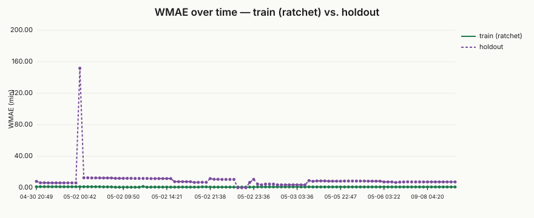
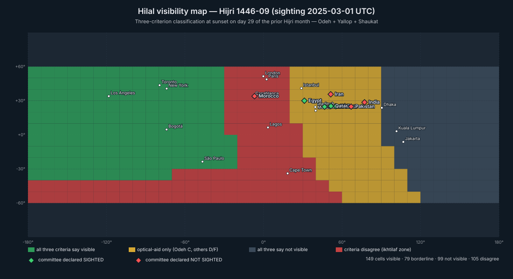

# fajr فجر

[](https://github.com/tawfeeqmartin/fajr/actions/workflows/test.yml)
[](https://www.npmjs.com/package/@tawfeeqmartin/fajr)
[](LICENSE)

Last refreshed: 2026-05-14

`fajr` is an offline JavaScript library for Islamic prayer times, qibla, Hijri dates, and hilal visibility. It builds on [`adhan.js`](https://github.com/batoulapps/adhan-js), then adds:

- GPS-aware method dispatch across 168 countries and 481 city boxes.
- Provenance fields that explain which method, elevation, and Asr convention were used.
- Per-prayer ihtiyat-aware rounding and an explicit `imsak` field.
- Three-criterion hilal visibility: Odeh 2004, Yallop 1997, and Shaukat 2002.
- A public eval ratchet against institutional and mosque-published references.

Status: **v1.x public beta**. The API is usable and tested, but calculation defaults remain best-effort computed values. For consequential decisions, verify location, settings, and local mosque/scholar guidance. This README describes the repository state; the npm badge above is the source of truth for the latest published package, which may lag briefly after a merge.

Core docs:

- [docs/positions.md](docs/positions.md) - canonical regional defaults and confidence grades.
- [docs/known-disagreements.md](docs/known-disagreements.md) - where local authorities or valid methods differ.
- [CALIBRATION.md](CALIBRATION.md) - accuracy methodology, ratchet rules, and current caveats.
- [SCOREBOARD.md](SCOREBOARD.md) - generated release health, WMAE, coverage, and open-issue snapshot.
- [docs/progress.md](docs/progress.md) - generated WMAE dashboard and trend charts.
- [docs/data-sources.md](docs/data-sources.md) - source inventory and fixture-refresh status.
- [docs/city-geometry-audit.md](docs/city-geometry-audit.md) - build-time QA plan for reverse-geolocation bboxes.
- [examples/agiftoftime/INTEGRATION.md](examples/agiftoftime/INTEGRATION.md) - app-side integration guide for [A Gift of Time](https://agiftoftime.app).

## Install

```bash
npm install @tawfeeqmartin/fajr
```

```js
import { prayerTimes, featureInfo, features } from '@tawfeeqmartin/fajr'

const times = prayerTimes({
  latitude: 33.9716,
  longitude: -6.8498,
  date: new Date(),
})

console.log(times.fajr)
console.log(times.location)
console.log(times.applied)
console.log(times.notes)
console.log(features().map(featureInfo))
```

`fajr` is pure ESM and has no runtime network dependency. It runs in Node, modern browsers, React Native, Expo, Capacitor, Electron, Tauri, Deno, Bun, and edge runtimes. Native Swift/Kotlin/C#/Rust ports are tracked separately in [issue #44](https://github.com/tawfeeqmartin/fajr/issues/44).

## What You Get

`prayerTimes()` returns the prayer times plus enough context for a downstream app to explain the result:

```js
{
  imsak:   Date,
  fajr:    Date,
  shuruq:  Date,
  sunrise: Date,
  dhuhr:   Date,
  asr:     Date,
  maghrib: Date,
  sunset:  Date,
  isha:    Date,

  method: 'Morocco (19°/17° community calibration)',
  notes: [],
  validityWarnings: [],

  location: {
    city: City | null,
    country: 'Morocco',
    timezone: 'Africa/Casablanca',
    elevation: 75,
    asrConvention: 'standard',
    methodSource: 'country-default',
    asrConventionSource: 'country-default',
    elevationSource: 'city-registry',
  },

  applied: {
    method: 'Morocco (19°/17° community calibration)',
    asrSchool: 'standard',
    elevationMin: 0.59,
  },

  corrections: {
    elevation: true,
    elevationCorrectionMin: 0.59,
    refraction: 'standard (0.833°)',
    rounding: 'ihtiyat-aware per-prayer ...',
    imsak_offset_min: 10,
  },

  disclaimer: 'Computed defaults are a best guess ...',
}
```

Use `location.asrConvention` for local Asr-convention metadata and `applied.asrSchool` for the formula actually used. These are **not** a full legal-madhhab taxonomy: Morocco, for example, is Maliki, while its relevant Asr-convention value is `standard` 1x shadow. The older `location.madhab` / `applied.madhab` fields are deprecated compatibility aliases; from v1.8.1 they mirror `standard` / `hanafi` Asr values and no longer return `shafii` for generic standard 1x Asr. Do not render them as "local madhhab." Hanafi-convention countries can report `location.asrConvention: 'hanafi'` while keeping `applied.asrSchool: 'standard'` when the selected timetable method uses standard 1x Asr. When that mismatch matters, `notes[]` includes an Asr-convention advisory.

For user settings, prefer the grouped `override` object. It keeps the user's
choice separate from the detected defaults and updates the provenance fields:

```js
const hanafi = prayerTimes({
  latitude,
  longitude,
  date: new Date(),
  override: {
    asrConvention: 'hanafi', // or 'standard'
    method: 'Diyanet',       // optional; otherwise auto-detected
    elevation: 0,            // optional; explicit sea-level / uniform-city stance
  },
})

console.log(hanafi.location.asrConventionSource) // 'caller-explicit'
console.log(hanafi.applied.asrSchool)            // 'hanafi'
```

For regional defaults, read [docs/positions.md](docs/positions.md). For areas
where authorities or valid methods differ, read
[docs/known-disagreements.md](docs/known-disagreements.md).

For qiyam and night divisions, use `dayTimes()` or `nightThirds()`:

```js
import { dayTimes, nightThirds } from '@tawfeeqmartin/fajr'

const day = dayTimes({ latitude, longitude, date: new Date() })
console.log(day.midnight)
console.log(day.qiyam)      // start of the last third

const thirds = nightThirds({ date: new Date(), latitude, longitude })
console.log(thirds.firstThird)
console.log(thirds.lastThird)
```

## Safe-Use Framing

`fajr` improves the wasail, the means of calculating time. It does not issue religious rulings.

For everyday use, the defaults are designed to be practical and transparent. For fasting, Eid, traveler rulings, high-latitude summers, high-elevation locations, or Asr-convention-specific timing:

1. Verify the resolved city and country.
2. Check the calculation method, elevation stance, and Asr convention.
3. Render `notes[]`, `validityWarnings[]`, and `disclaimer` in the app.
4. Follow the local mosque or scholar when practice differs from the computed default.

This is the same stance used by the reference downstream app, [A Gift of Time](https://agiftoftime.app). See [examples/agiftoftime/INTEGRATION.md](examples/agiftoftime/INTEGRATION.md) for the app-side integration checklist and provenance UX notes.

## Current Snapshot

| Area | Current state |
|---|---|
| Repository version | `1.8.1` in `package.json`; published npm version may lag until release |
| City/country dispatch | 481 cities, 168 countries |
| Train eval | 215 entries, WMAE 0.9757 min |
| Holdout eval | 54,639 entries, WMAE 7.3646 min |
| Reference layers | Mawaqit, Diyanet, JAKIM, KEMENAG, MUIS, Habous, Aladhan, praytimes.org, Who's On First |
| Hilal validation | 78 documented committee decisions across 15 Hijri month onsets |
| Runtime dependency | `adhan` only |

Live release health is generated in [SCOREBOARD.md](SCOREBOARD.md). Detailed
eval charts are generated in [docs/progress.md](docs/progress.md).



## Why fajr Instead of adhan-js or AlAdhan?

Use `adhan-js` when you already know the method and want the small standard calculation library. Use AlAdhan when you want a hosted API with address-string lookup.

Use `fajr` when you want offline local computation plus:

- Automatic method dispatch from coordinates.
- City-level overrides and elevation provenance.
- Mosque/institution validated calibration work with public WMAE reports.
- `notes[]`, `location`, `applied`, and `disclaimer` fields for app UX.
- Hilal visibility and Hijri support in the same package.

`fajr` does not replace `adhan-js`; it wraps and extends it.

## Main APIs

| API | Purpose |
|---|---|
| `prayerTimes(params)` | Six prayer times plus imsak, sunrise/shuruq, sunset, provenance, notes |
| `dayTimes(params)` | `prayerTimes` plus midnight and qiyam start |
| `astronomical(lat, lon, date)` | Raw solar/twilight/Asr primitives with no regional offsets |
| `features()`, `featureInfo(key)` | Structured settings metadata for app UIs |
| `detectLocation(lat, lon)` | Bbox-precise city/country/method/elevation lookup |
| `nearestCity(lat, lon)` | Display-only nearest-city label, never used for dispatch |
| `qibla({ latitude, longitude })` | Qibla bearing |
| `hijri(date, opts?)` | Umm al-Qura tabular Hijri date by default; legacy tabular opt-in |
| `hilalVisibility(params)` | Odeh/Yallop/Shaukat crescent visibility side by side |
| `nightThirds(params)` | First, second, last third, and midnight |
| `travelerMode({ times, madhab? })` | Qasr/jam metadata; user determines traveler status |
| `applyElevationCorrection(times, elevation, latitude?)` | Opt-in geometric horizon correction |
| `applyTayakkunBuffer(times, mins?)` | Opt-in Fajr buffer |
| `tarabishyTimes(params, thresholdLat?)` | Opt-in high-latitude alternative |
| `prayerNames`, `prayerName()` | Localized prayer labels |

TypeScript declarations ship with the package.

Use `astronomical()` when an app needs the raw Layer 1 events behind a
regional default:

```js
import { astronomical, prayerTimes } from '@tawfeeqmartin/fajr'

const date = new Date('2026-05-05T12:00:00Z')
const raw = astronomical(33.5731, -7.5898, date)
const official = prayerTimes({ latitude: 33.5731, longitude: -7.5898, date })

console.log(raw.apparentSunset)
console.log(official.maghrib) // Morocco default includes institutional buffer/rounding
```

## App Integration Pattern

For web/mobile apps:

1. Request high-accuracy GPS when possible.
2. Pass `latitude`, `longitude`, `date`, and a reliable `elevation` if the platform provides one.
3. Render the returned `location`, `applied`, `notes`, and `disclaimer` in a "why this time?" sheet.
4. Render `validityWarnings[]` prominently when any entry has `severity: 'critical'`.
5. Let users override method/elevation/Asr convention when their local mosque differs.

```js
import { prayerTimes, nearestCity, features, featureInfo } from '@tawfeeqmartin/fajr'

const settings = features().map(featureInfo)

const times = prayerTimes({
  latitude,
  longitude,
  date: new Date(),
  override: {
    elevation: gpsAltitude ?? undefined,
    asrConvention: userAsrConvention ?? undefined,
    method: userMethod ?? undefined,
  },
})

const label = times.location.city
  ? times.location.city.name
  : `near ${nearestCity(latitude, longitude).city.name}`

renderPrayerCard({
  label,
  prayers: times,
  provenance: times.applied,
  notes: times.notes,
  warnings: times.validityWarnings,
  disclaimer: times.disclaimer,
})
```

## Accuracy Model

Accuracy changes are evaluated by `node eval/eval.js` and gated by `npm run compare`.

The train set gates the ratchet. The holdout set is diagnostic only and must not be optimized against. A change that improves the aggregate but worsens a city/source cell or unsafe prayer bias is rejected.

Reference layers are not blended into a single hidden "truth":

- Mosque-published reality: Mawaqit.
- Institutional tables: Diyanet, JAKIM, KEMENAG, MUIS.
- Regional-method consensus: Aladhan and praytimes.org.
- Third-party holdout: muslimsalat.com.

Read more:

- [CALIBRATION.md](CALIBRATION.md) - methodology, ratchet rules, current caveats.
- [docs/progress.md](docs/progress.md) - generated WMAE tables and trends.
- [docs/calibration-recipe.md](docs/calibration-recipe.md) - how calibration PRs are prepared.
- [docs/data-sources.md](docs/data-sources.md) - source inventory and fetch status.

## Hilal and Hijri

`hijri()` defaults to the Umm al-Qura tabular calendar for ecosystem compatibility with AlAdhan, IslamicFinder, IACAD, and common platform calendars. The legacy Kuwaiti tabular convention remains available:

```js
import { hijri, hilalVisibility } from '@tawfeeqmartin/fajr'

const today = hijri(new Date())
const legacy = hijri(new Date(), { convention: 'tabular' })

const hilal = hilalVisibility({
  year: 1447,
  month: 9,
  latitude: 21.4225,
  longitude: 39.8262,
})

console.log(hilal.code, hilal.label)
console.log(hilal.yallop)
console.log(hilal.shaukat)
console.log(hilal.criteriaAgree)
```

Hilal output is astronomical possibility, not a religious ruling. See [docs/hilal-historical-analysis.md](docs/hilal-historical-analysis.md), [docs/lunar-jpl-validation.md](docs/lunar-jpl-validation.md), and [docs/solar-jpl-validation.md](docs/solar-jpl-validation.md).



## Documentation Map

| Need | Read |
|---|---|
| What fajr does by default in each region | [docs/positions.md](docs/positions.md) |
| Where valid authorities or practices differ | [docs/known-disagreements.md](docs/known-disagreements.md) |
| Accuracy and ratchet methodology | [CALIBRATION.md](CALIBRATION.md) |
| Current release health | [SCOREBOARD.md](SCOREBOARD.md) |
| Generated eval dashboard | [docs/progress.md](docs/progress.md) |
| Integration in A Gift of Time | [examples/agiftoftime/INTEGRATION.md](examples/agiftoftime/INTEGRATION.md) |
| Source inventory | [docs/data-sources.md](docs/data-sources.md) |
| City bbox geometry audit | [docs/city-geometry-audit.md](docs/city-geometry-audit.md) |
| Scholarly review brief | [docs/scholar-review-brief.md](docs/scholar-review-brief.md) |
| Hilal historical analysis | [docs/hilal-historical-analysis.md](docs/hilal-historical-analysis.md) |
| Release log | [CHANGELOG.md](CHANGELOG.md) |
| Agent/research rules | [CLAUDE.md](CLAUDE.md) |

## Contributing

Useful contributions:

- Regression reports with coordinates, date, local timetable source, and expected time.
- Official timetable sources suitable for `eval/data/train`.
- Holdout sources for cross-validation.
- City registry fixes with bbox evidence.
- Scholarly review of 🟡 or 🔴 corrections.
- Downstream integration feedback from real apps.

Accuracy PRs should modify one concern at a time, run `node eval/eval.js` and `npm run compare`, and include an `autoresearch/logs/` entry. Do not modify `eval/`, `eval/data/`, or `knowledge/wiki/` as part of an autoresearch change.

## Credits

`fajr` stands on the Islamic astronomy and muwaqqit tradition, and on modern open work by Batoul Apps (`adhan-js`), Hamid Zarrabi-Zadeh (`praytimes.org`), [AlAdhan](https://aladhan.com), Who's On First / Geocode Earth, ICOP/Odeh, Yallop/HMNAO, Shaukat/Pakistan Ruet-e-Hilal, JPL Horizons, and the institutions and mosques that publish prayer and hilal data.

MIT © Tawfeeq Martin

> "Indeed, the prayer has been decreed upon the believers a decree of specified times." - Quran 4:103

`fajr` is a sadaqah jariyah dedicated to my daughters Nurjaan and Kauthar.

It began from [A Gift of Time](https://agiftoftime.app), a study in light, time, orientation and a call to prayer, built with Kauthar, and the question: how do we know these times are right?
