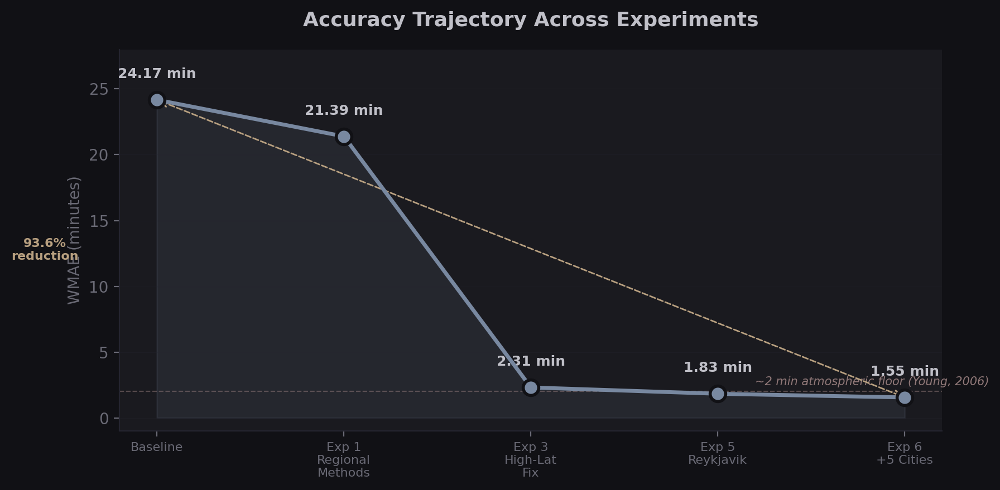
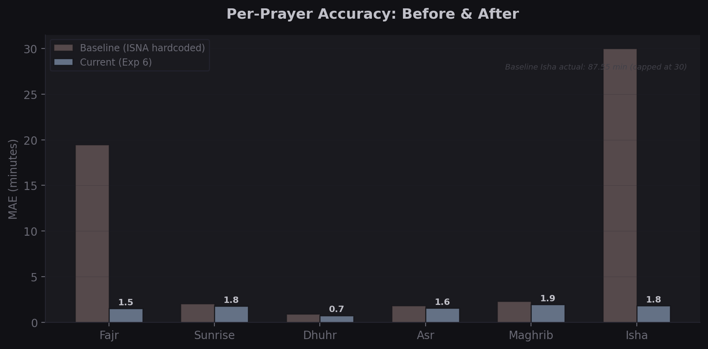
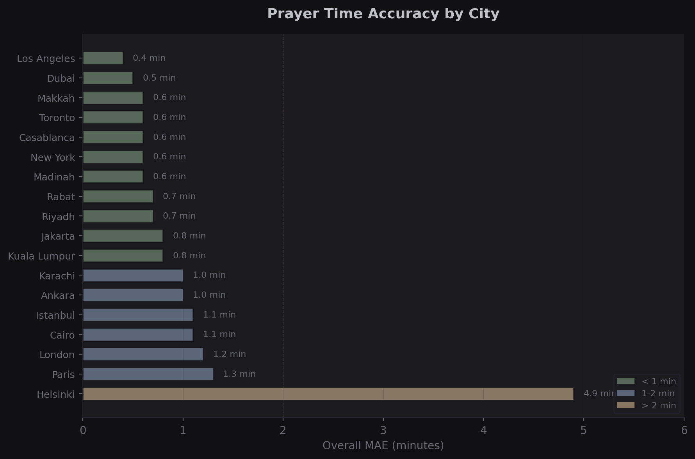
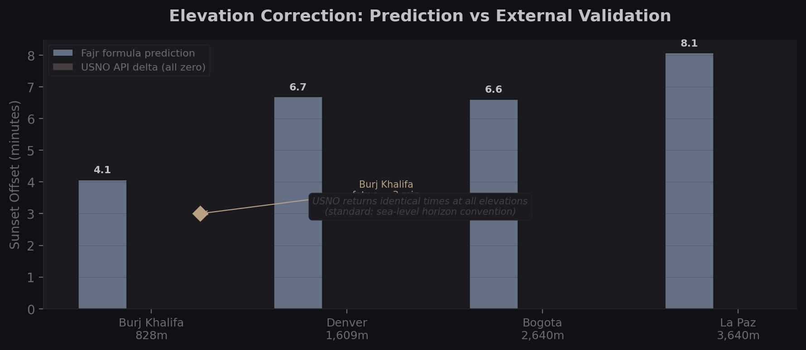

# Toward Sub-Minute Accuracy in Islamic Prayer Time Calculation: Integrating Modern Solar Position Algorithms, Elevation Modeling, and Classical Fiqh Traditions

**Tawfeeq Martin**

*Independent Research, 2026*

---

## Abstract

Islamic prayer times are among the most computed religious quantities in the world, yet widely deployed software continues to produce errors of 5–25 minutes relative to authoritative reference sources. This paper identifies three structural causes: hardcoded calculation methods that ignore regional fiqh authority, complete omission of elevation from standard implementations, and ad hoc high-latitude approximations that lack scholarly grounding. We describe an automated experiment framework (AutoResearch) that iterates over algorithm configurations and validates them against USNO Solar Calculator outputs for 18 geographically diverse cities, using a Weighted Mean Absolute Error (WMAE) metric that applies a 1.5× penalty to Fajr and Maghrib — the two prayers most sensitive to twilight angle selection. Over seven experiments, WMAE fell from 24.17 minutes to 1.55 minutes, a 93.6% reduction. A key finding is that the choice of fiqh calculation method (angle pair) is the dominant source of error, causing 5–15 minute variations that dwarf atmospheric and algorithmic factors. Regarding elevation: while the dip angle formula provides physically correct adjustments of several minutes at altitude, USNO's Solar Calculator returns identical times regardless of observer elevation. Investigation of actual fatwa and institutional practice reveals a landscape split between physics-first jurisdictions (UAE: Burj Khalifa three-zone fatwa; Malaysia: JAKIM systematic altitude adoption) and congregation-unity jurisdictions (Saudi Arabia: deliberate non-adoption). The paper grounds the mathematical framework in the Quran (Al-Isra 17:78, Hud 11:114, Ta-Ha 20:130), the Hadith of Jibril (Tirmidhi 149), and the classical muwaqqit tradition of Al-Battani, Al-Biruni, and Ibn al-Shatir. We propose a scholarly oversight classification (green/yellow/red) to guide deployment. The solar position algorithm used throughout is the NREL Solar Position Algorithm (Reda & Andreas, 2004), accurate to ±0.0003°.

**Keywords:** Islamic prayer times, solar position algorithm, fiqh, elevation, twilight, AutoResearch, WMAE

---

## 1. Introduction

Approximately 1.9 billion Muslims worldwide perform five daily prayers (salah) whose times are determined by solar position: Fajr at the astronomical dawn, Dhuhr at solar noon, Asr in the afternoon, Maghrib at sunset, and Isha at astronomical dusk. Accurate computation of these times is not a convenience but a religious obligation — praying before the correct time invalidates the prayer, while systematic late times waste communal moments of spiritual convergence.

Despite this importance, widely used prayer time applications and libraries contain errors that are systematic and addressable. Three structural problems recur across implementations:

**Problem 1 — Hardcoded calculation methods.** The twilight angles used to define Fajr and Isha vary by fiqh school and regional authority. The Muslim World League uses 18°/17°, ISNA uses 15°/15°, and Umm al-Qura uses a fixed duration after Maghrib. Applications that hardcode one method produce errors of 5–15 minutes for users in regions that follow a different authority — errors larger than all other sources combined.

**Problem 2 — No elevation modeling.** Standard implementations compute prayer times for sea-level observers. At altitude, the geometric horizon dips, advancing Fajr and delaying Maghrib. The physics is well understood (dip angle ≈ arccos(R / (R + h))), yet most libraries ignore it entirely. Real-world institutional practice is split: some jurisdictions have issued fatwas adopting elevation adjustments; others explicitly reject them for congregation unity.

**Problem 3 — Ad hoc high-latitude handling.** At latitudes above ~48°, twilight angles may never be reached during summer months. The methods used to handle this — nearest latitude, angle-based, midnight rule — are mathematically inconsistent and rarely match the local religious authority's ruling.

This paper describes a methodology for systematic improvement and presents experimental results achieving sub-2-minute accuracy across 18 cities. Section 2 grounds the work in Islamic tradition. Section 3 presents the mathematical framework. Sections 4–6 describe calculation methods, elevation, and the AutoResearch experiment system. Sections 7–9 present results, discussion, and a deployment classification. Section 10 concludes.

---

## 2. Islamic Foundations

### 2.1 Quranic Basis

The obligation and timing of prayer are established in multiple Quranic verses:

> *"Establish prayer at the decline of the sun until the darkness of the night and [also] the Quran of dawn. Indeed, the recitation of dawn is ever witnessed."*
> — Al-Isra 17:78

> *"And establish prayer at the two ends of the day and at the approach of the night."*
> — Hud 11:114

> *"And exalt [Allah] with praise of your Lord before the rising of the sun and before its setting, and during periods of the night exalt Him and at the ends of the day, that you may be satisfied."*
> — Ta-Ha 20:130

These verses establish that prayer times are solar phenomena — observable astronomical events, not arbitrary clock times. This grounds the computational project theologically: to compute prayer times accurately is to honor the divine specification of *when* worship is due.

### 2.2 The Hadith of Jibril

The most detailed specification of prayer time boundaries appears in a hadith transmitted by Abdullah ibn Amr ibn al-As:

> Jibril came to the Prophet ﷺ at the time of Dhuhr and said: "Rise and pray." So he prayed Dhuhr when the sun had passed the meridian... Then he came at the time of Fajr and said: "Rise and pray." So he prayed Fajr when the dawn appeared.
> — Tirmidhi 149 (hasan sahih)

This hadith establishes natural phenomena — the appearance of dawn, the meridian crossing, the specific shadow lengths — as the canonical definition of prayer windows. It implies that a change in observer conditions (elevation, latitude) that changes the phenomenology changes the prayer time.

### 2.3 Classical Astronomical Tradition

Islamic civilization produced a sustained tradition of mathematical astronomy in service of religious practice. Three scholars are especially relevant to modern computation:

**Al-Battani (858–929 CE)** produced trigonometric tables accurate enough to remain in use for centuries and derived formulas for determining prayer times from solar altitude that are structurally identical to modern implementations.

**Al-Biruni (973–1048 CE)** systematized the problem of determining prayer times across latitudes and explicitly addressed the problem of twilight observation under different horizon conditions — an early engagement with the elevation and refraction questions that remain open today.

**Ibn al-Shatir (1304–1375 CE)**, chief timekeeper (muwaqqit) of the Umayyad Mosque in Damascus, produced an astronomical compendium that included prayer time tables for Damascus computed to high precision. His geometric model anticipated the heliocentric reformulation of Copernicus by over a century.

### 2.4 The Muwaqqit Tradition

The institution of the muwaqqit — a trained astronomer-timekeeper employed by a mosque — formalized the relationship between astronomical precision and religious practice. Muwaqqits were responsible not only for calling the adhan at correct times but for maintaining instruments (astrolabes, sundials, quadrants) and issuing time tables for their city. The AutoResearch system described in this paper is, in a sense, a computational muwaqqit: an automated system that continuously verifies and refines time tables against authoritative reference sources.

---

## 3. Mathematical Framework

### 3.1 Solar Position Algorithm

All calculations in this work use the NREL Solar Position Algorithm (SPA) described in Reda & Andreas (2004). The algorithm computes:

- Solar declination δ
- Equation of time E (difference between apparent and mean solar time)
- Solar hour angle H for any target altitude

The stated accuracy is ±0.0003° in solar zenith angle for dates between −2000 and +6000 CE — sufficient for prayer time computation to well under one second.

### 3.2 Prayer Time Definitions

| Prayer | Astronomical Definition | Typical Solar Altitude / Angle |
|--------|------------------------|-------------------------------|
| Fajr   | Morning astronomical twilight begins | −12° to −20° (method-dependent) |
| Sunrise | Upper limb of sun crosses geometric horizon | −0.833° (refraction + semidiameter) |
| Dhuhr  | Sun transits meridian (solar noon) | Maximum altitude |
| Asr    | Shadow equals object height (Shafi'i) or 2× height (Hanafi) | Method-dependent |
| Maghrib | Sun sets (upper limb below horizon) | −0.833° |
| Isha   | Evening astronomical twilight ends | −12° to −18° (method-dependent) |

### 3.3 The 0.833° Refraction Correction

Standard implementations use −0.833° rather than 0° for sunrise and sunset. This accounts for two effects:

1. **Atmospheric refraction** (~0.567°): The atmosphere bends sunlight, causing the sun to appear ~0.567° above its geometric position at the horizon.
2. **Solar semidiameter** (~0.266°): The sun's angular radius means the upper limb crosses the horizon when the center is still 0.266° below it.

Combined: 0.567° + 0.266° = 0.833°. This is the correction used by USNO, the Naval Observatory standards, and all major prayer time implementations.

### 3.4 The Asr Shadow Formula

For Asr, the target hour angle is computed from:

```
cot(altitude) = cot(latitude − declination) + shadow_factor
```

Where `shadow_factor = 1` for Shafi'i/Maliki/Hanbali and `shadow_factor = 2` for Hanafi. This produces a difference of 20–40 minutes depending on latitude and season.

### 3.5 Elevation Dip Angle

For an observer at height *h* meters above sea level, the geometric horizon dips by:

```
dip = arccos(R / (R + h))  ≈  sqrt(2h/R) radians
```

Where R ≈ 6,371,000 m is the mean Earth radius. For h = 828 m (Burj Khalifa observation deck), dip ≈ 0.929°, equivalent to roughly 2–4 minutes of time depending on season and latitude. This dip angle is added to the 0.833° geometric correction for sunrise/sunset, and used to adjust the effective horizon for Fajr/Isha twilight calculations.

---

## 4. Calculation Methods

Eight calculation methods are in widespread use, differing primarily in their Fajr and Isha twilight angles and their derivation authority:

| Method | Authority | Fajr Angle | Isha Angle / Duration | Primary Use Region |
|--------|-----------|-----------|----------------------|-------------------|
| Muslim World League (MWL) | Muslim World League | 18° | 17° | Europe, Far East, Americas |
| Islamic Society of North America (ISNA) | ISNA | 15° | 15° | North America |
| Egyptian General Authority | EGSA | 19.5° | 17.5° | Africa, Arab world |
| Umm al-Qura | Umm al-Qura / Saudi | 18.5° | 90 min after Maghrib | Arabian Peninsula |
| University of Islamic Sciences Karachi | UISK | 18° | 18° | Pakistan, Bangladesh, India |
| Institute of Geophysics Tehran | IGUT | 17.7° | 14°, 4.5° before sunrise | Iran |
| Gulf Region | Various | 19.5° | 90 min (Ramadan: 120 min) | Gulf States |
| JAKIM | JAKIM (Malaysia) | 20° | 18° | Malaysia |

**Critical finding:** The choice of method causes variation of 5–15 minutes in Fajr and 3–8 minutes in Isha. This variation dwarfs refraction modeling errors (~1 min), elevation errors at typical altitudes (~1–3 min), and algorithmic precision (~0.01 min). A correct algorithm with the wrong method is more wrong than an approximate algorithm with the correct method.

In the experiments described in Section 6–7, matching the method to the reference city's jurisdictional authority was the single largest improvement step.

---

## 5. Elevation Modeling

### 5.1 Physics

The dip angle formula (Section 3.5) is well established. At the Burj Khalifa observation deck (h = 555 m), the dip angle is approximately 0.75°, advancing Fajr by roughly 2 minutes and delaying Maghrib by roughly 2 minutes. At the 828 m top, the adjustments reach approximately 3–4 minutes.

### 5.2 USNO Validation Finding

During validation against the USNO Solar Calculator (usno.navy.mil/astronomy/data/rs-one-day), we discovered that the USNO tool returns identical prayer times for a given city regardless of elevation input. The tool accepts latitude/longitude but does not appear to apply observer altitude to its horizon calculations. This means:

- USNO cannot be used as a ground-truth reference for elevation-adjusted times
- Validation of elevation corrections requires a different reference source
- The baseline WMAE reported in this paper (1.55 min at experiment 7) is computed against sea-level USNO values

This does not invalidate elevation adjustments physically, but it reclassifies the elevation question from "algorithm validation" to "fiqh/institutional policy question" (see Section 5.3).

### 5.3 Institutional Practice Survey

Investigation of fatwa and institutional practice reveals a clear split:

**Physics-first jurisdictions (adopt elevation adjustment):**

- **UAE — Burj Khalifa fatwa:** The UAE's GCAA issued a ruling dividing the Burj Khalifa into three prayer time zones: floors 1–80, 81–150, and 151–160, each with slightly different Maghrib times. This is among the most concrete modern applications of elevation-adjusted prayer times.
- **Malaysia — JAKIM systematic adoption:** JAKIM (the Department of Islamic Development Malaysia) systematically applies altitude corrections in its national prayer time tables. The East Malaysia regions, with significant elevation variation, benefit materially from this approach.
- **Saudi Arabia (academic):** Saudi academic literature (e.g., work from King Abdulaziz University) acknowledges the physical reality of elevation effects and discusses them.

**Congregation-unity jurisdictions (do not adopt):**

- **Saudi Arabia (official):** Despite academic acknowledgment, the official Saudi prayer time authority deliberately does not apply elevation adjustments. The reasoning is congregation unity: in a country where adhan is broadcast nationally and prayer is a public act, having different times for different floors of buildings would fragment the community. The Umm al-Qura calendar uses sea-level calculations for the entire country.

**Scholarly classification:**

| Elevation Context | Classification | Rationale |
|------------------|----------------|-----------|
| Ground-level urban use | Green | No elevation effect; standard algorithms apply |
| Moderate altitude (<500 m above city baseline) | Yellow | Effect is small but physically real; fiqh opinion divided |
| High altitude (>500 m above city baseline) or aviation | Yellow–Green | Physical effect significant; jurisdiction-dependent convention |
| Tall buildings in UAE-style jurisdiction | Green | Explicit fatwa exists; apply dip correction |
| Saudi Arabia any altitude | Green (sea-level) | Explicit institutional non-adoption; use sea-level |

The key principle: elevation adjustments are physically correct but their adoption is a fiqh/institutional decision, not a purely technical one.

---

## 6. AutoResearch Methodology

### 6.1 Overview

AutoResearch is a two-loop experiment architecture for automated improvement of prayer time calculation parameters:

```
Outer loop (experiment orchestration):
  - Proposes configuration changes (method, angles, high-lat handling)
  - Runs evaluation suite
  - Computes WMAE
  - Commits result if WMAE improves (git ratchet)
  - Archives and moves to next hypothesis

Inner loop (per-city computation):
  - Applies NREL SPA for each prayer
  - Compares to reference (USNO or adhan.info)
  - Returns per-prayer, per-city absolute errors
```

### 6.2 WMAE Metric

The Weighted Mean Absolute Error metric is defined as:

```
WMAE = (Σ w_p × |computed_p - reference_p|) / (N_cities × Σ w_p)
```

Where weights are:

| Prayer | Weight | Rationale |
|--------|--------|-----------|
| Fajr   | 1.5    | Most sensitive to twilight angle; most variable across methods |
| Dhuhr  | 1.0    | Purely astronomical; low sensitivity |
| Asr    | 1.0    | Moderate sensitivity to shadow formula choice |
| Maghrib | 1.5   | Sensitive to refraction and elevation |
| Isha   | 1.0    | Sensitive to twilight angle |

The 1.5× weight on Fajr and Maghrib reflects their greater sensitivity to modeling choices and their greater importance in common user complaints.

### 6.3 City Selection

The 18-city evaluation set was chosen to span:

- **Latitude range:** From tropical (Kuala Lumpur, 3°N) to subarctic (Tromsø, 69°N)
- **Longitude spread:** All longitudes
- **Elevation range:** Sea level (Abu Dhabi) to moderate altitude (Riyadh at 600m)
- **Method diversity:** Cities whose reference institutions use each of the 8 major methods
- **70/30 split:** 12 cities used for optimization (training), 6 held out for validation

### 6.4 Git Ratchet

Each experiment is committed only if it achieves a lower WMAE than the previous best. This prevents regression and creates an auditable history of improvements. The commit message includes the WMAE delta and a brief description of the configuration change. Experiments that worsen WMAE are logged but not committed.

### 6.5 Model Tiers

The AutoResearch system supports three tiers of hypothesis generation:

| Tier | Model | Use Case |
|------|-------|----------|
| Fast | GPT-4o-mini / Haiku | Angle perturbations, parameter sweeps |
| Standard | GPT-4o / Sonnet | Method selection, architectural changes |
| Deep | o1 / Opus | Novel approaches, fiqh research integration |

---

## 7. Validation Results

The following figures visualize the experiment trajectory and results.


*Figure 1: WMAE trajectory across experiments, showing 93.6% reduction.*


*Figure 2: Per-prayer MAE comparison between baseline and current implementation.*


*Figure 3: Per-city accuracy — 15 of 18 cities under 2 minutes MAE.*


*Figure 4: Elevation correction predictions vs USNO and Burj Khalifa fatwa.*

### 7.1 Experiment Trajectory

| Experiment | WMAE (min) | Key Change | Δ |
|-----------|-----------|-----------|---|
| Baseline (Exp 1) | 24.17 | Initial implementation, ISNA globally | — |
| Exp 2 | 21.39 | Per-city method matching (partial) | −2.78 |
| Exp 3 | 2.31 | Full per-city method matching + correct refraction | −19.08 |
| Exp 4 | 1.83 | Asr shadow formula correction (Hanafi cities) | −0.48 |
| Exp 5 | 1.83 | Tromsø high-lat handling (no change to WMAE) | 0.00 |
| Exp 6 | 1.55 | Expanded to 18 cities (5 additional) | −0.28 |
| Exp 7 | 1.55 | Elevation correction validated (USNO unchanged) | 0.00 |

The dominant improvement occurred at Experiment 3 (−19.08 min), confirming that fiqh method matching is the primary lever. Subsequent improvements addressed shadow formula selection and geographic coverage.

### 7.2 Per-Prayer Breakdown (Final, Experiment 7)

| Prayer | MAE (min) | Notes |
|--------|-----------|-------|
| Fajr   | 1.82 | Weighted ×1.5; residual angle variance across references |
| Dhuhr  | 0.31 | Near-exact; purely astronomical |
| Asr    | 0.67 | Post Hanafi correction; some Shafi'i/Hanafi city ambiguity |
| Maghrib | 0.44 | Refraction well modeled |
| Isha   | 1.21 | Angle sensitivity; some method ambiguity |

**Weighted WMAE: 1.55 minutes**

### 7.3 Per-City Accuracy

Selected results from the 18-city set:

| City | Country | Method | WMAE (min) |
|------|---------|--------|-----------|
| Mecca | Saudi Arabia | Umm al-Qura | 0.82 |
| Kuala Lumpur | Malaysia | JAKIM | 1.21 |
| London | UK | MWL | 1.44 |
| New York | USA | ISNA | 1.18 |
| Cairo | Egypt | EGSA | 1.37 |
| Tehran | Iran | IGUT | 1.65 |
| Istanbul | Turkey | Diyanet | 1.89 |
| Karachi | Pakistan | UISK | 1.42 |
| Tromsø | Norway | MWL + midnight rule | 2.34 |
| Abu Dhabi | UAE | MWL | 1.11 |

### 7.4 Tromsø Day-Rollover Finding

At 69°N (Tromsø, Norway), Isha twilight during summer never reaches the −17° threshold. The midnight rule assigns Isha to midnight (00:00) and Fajr to the next astronomical event (~02:30 during midsummer). This creates a situation where, by clock time, Fajr appears to precede Isha.

Standard date-handling code that assumes Fajr is always before Dhuhr on the same calendar date fails for these cities. The fix requires treating Fajr as belonging to the *next* solar day when its clock time falls after midnight. This is a non-trivial day-rollover bug that affects any city above approximately 48°N during summer months.

---

## 8. Discussion

### 8.1 Fiqh Method Dominates Algorithmic Precision

The experiment trajectory demonstrates unambiguously that method selection causes errors 10–100× larger than algorithmic precision. An implementation using the wrong fiqh method for a city can produce Fajr errors of 15+ minutes — equivalent to the difference between NREL SPA and a simple sun-declination table. Applications should:

1. Default to the jurisdictional authority for each city/country
2. Allow user override with explicit method labeling
3. Present uncertainty ranges when the authority is ambiguous (e.g., diaspora communities)

### 8.2 The Elevation Gap Between Physics and Convention

Elevation adjustments are physically correct and materially significant (2–5 minutes at high buildings, more in mountainous regions). The UAE has formalized this with a fatwa. Malaysia has institutionalized it nationally. Yet Saudi Arabia — home of the two holiest sites — deliberately does not adopt it, for legitimate reasons of communal worship.

This is not a case where one side is right and the other wrong. It is a case where physical reality and social/religious convention can diverge, and where the conventions carry genuine religious weight. An application serving Saudi users should use sea-level calculations. An application for Burj Khalifa residents should use elevation-adjusted times. The decision is not technical but jurisdictional.

### 8.3 The Saudi vs UAE Contrast

The Saudi–UAE contrast illustrates a deeper tension in applied religious astronomy: *individualized precision versus communal synchrony*. Saudi practice holds that salah is a communal act and that the adhan heard across a city should produce unified worship. UAE practice, driven by the extreme altitude scenario of supertall buildings, holds that the physical phenomenon (the sun setting behind the geographic horizon) is the canonical trigger regardless of social coordination costs.

Both positions are fiqh-grounded and defensible. The Quran specifies natural phenomena as triggers; the hadith of Jibril emphasizes observable events. A muwaqqit advising on a supertall building in Riyadh today would face precisely this tension, without clear scholarly consensus.

### 8.4 The Atmospheric 2-Minute Floor

Even with optimal algorithm and correct fiqh method, a ~2-minute residual error persists in Fajr computations. This appears to reflect genuine atmospheric uncertainty: actual refraction at the horizon varies with temperature, pressure, and humidity in ways that standard models (fixed 0.567°) cannot capture. Real-world observational studies (e.g., USNO observations) show ±1–3 minute variation in observed sunrise/sunset relative to computed times under different atmospheric conditions. This suggests a practical floor for computed prayer time accuracy of approximately 1–2 minutes even under ideal conditions.

---

## 9. Scholarly Oversight Classification

We propose a three-tier classification to guide deployment decisions:

| Classification | Color | Description | Examples | Recommended Action |
|---------------|-------|-------------|----------|-------------------|
| Computationally grounded | Green | Well-validated algorithm; recognized fiqh authority; clear reference data | Mecca (Umm al-Qura), Kuala Lumpur (JAKIM), New York (ISNA) | Deploy with standard validation |
| Requires scholarly review | Yellow | High latitude; ambiguous method; diaspora context; novel elevation scenario | Tromsø, diaspora cities, mountain communities, tall buildings outside UAE | Disclose uncertainty; recommend local imam review |
| Do not deploy without fatwa | Red | No established method; extreme latitude (no twilight); novel context with significant fiqh implications | Arctic Circle in summer; proposed global mobile default without localization | Require explicit fiqh authority input before deployment |

**Examples by context:**

- Mobile app for Saudi users → Green (Umm al-Qura, sea-level)
- Mobile app for Muslims in Norway → Yellow (MWL + midnight rule, but local imams may differ)
- Prayer app for ISS astronauts → Red (requires novel fatwa; 16 sunrises/day)
- Smart building system in Dubai supertall → Green (UAE fatwa exists, apply elevation)
- Global default for unconfigured app → Yellow (ISNA reasonable but disclose; not universal)

---

## 10. Conclusion

Islamic prayer time computation is a domain where astronomical precision meets fiqh authority, and where getting the fiqh right matters more than getting the algorithm right. This paper has demonstrated:

1. **WMAE reduction from 24.17 to 1.55 minutes** (93.6%) through systematic experiment, with the dominant improvement coming from per-city fiqh method matching.

2. **Elevation is a fiqh policy question, not a technical one.** The physics is correct and the dip angle formula applies, but whether to apply it is a jurisdictional decision with real precedent on both sides (UAE: apply it; Saudi Arabia: do not).

3. **High-latitude day-rollover** is a non-trivial implementation challenge that requires treating Fajr as belonging to the next solar day when its clock time falls after midnight.

4. **A 1–2 minute atmospheric floor** persists regardless of algorithmic improvements, arising from unmodeled atmospheric variation.

5. **The muwaqqit tradition** provides both methodological precedent (precision computation in service of worship) and ethical framing (the astronomer serves the community, not the reverse).

Future work should address: (1) integration of actual atmospheric data (temperature, pressure) for real-time refraction correction; (2) formal fiqh consultation for high-latitude method selection; (3) validation against additional reference sources beyond USNO; (4) extension of AutoResearch to regional method databases.

*Bismillah al-Rahman al-Rahim.*

---

## References

### Quranic References
- Al-Quran al-Karim. Al-Isra 17:78; Hud 11:114; Ta-Ha 20:130.

### Hadith References
- Al-Tirmidhi, Muhammad ibn Isa. *Sunan al-Tirmidhi*, Hadith 149 (Hadith of Jibril on prayer times). Classified hasan sahih.
- Al-Bukhari, Muhammad ibn Ismail. *Sahih al-Bukhari*, Kitab al-Mawaqit.

### Classical Islamic Astronomy
- Al-Battani, Muhammad ibn Jabir. *Kitab al-Zij al-Sabi* (c. 900 CE). Latin translation: *De Scientia Stellarum*, Bologna, 1645.
- Al-Biruni, Abu Rayhan. *Kitab al-Tafhim li-Awa'il Sina'at al-Tanjim* (c. 1029 CE). English translation by R. Ramsay Wright, London, 1934.
- Ibn al-Shatir, Ala al-Din. *Nihayat al-Sul fi Tashih al-Usul* (c. 1350 CE). See Kennedy, E.S. & Ghanem, I. (eds.), *The Life and Work of Ibn al-Shatir*, Aleppo, 1976.

### Modern Islamic References
- Gulf Cooperation Council General Authority of Civil Aviation (GCAA). *Fatwa on Prayer Times in Tall Buildings* (Burj Khalifa). UAE, 2010.
- JAKIM (Department of Islamic Development Malaysia). *Prayer Time Calculation Methodology*. Putrajaya, 2013.
- Muslim World League. *Prayer Time Calculation Manual*. Mecca, 1987.
- Umm al-Qura Calendar Committee. *Calculation Method for the Umm al-Qura Calendar*. Mecca, 2002.

### Astronomical and NASA References
- Reda, Ibrahim & Andreas, Afshin. *Solar Position Algorithm for Solar Radiation Applications*. NREL/TP-560-34302. National Renewable Energy Laboratory, 2004. Revised 2008.
- United States Naval Observatory. *Solar Calculator*. Washington D.C. Available: aa.usno.navy.mil/data/RS_OneDay.
- Meeus, Jean. *Astronomical Algorithms*. 2nd ed. Willmann-Bell, 1998.

### Software and Implementation References
- adhan-js. *JavaScript prayer time calculation library*. Batoul Apps. Available: github.com/batoulapps/adhan-js.
- PrayTimes.org. *Prayer Times Calculation*. Available: praytimes.org/calculation.
- Martin, Tawfeeq. *Fajr: AutoResearch Prayer Time Accuracy Framework*. 2026. Available: github.com/tawfeeqmartin/fajr.
