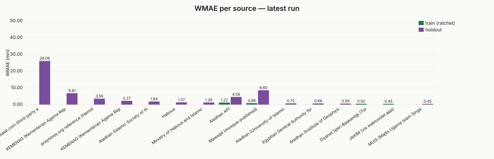
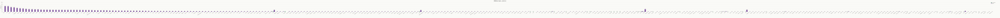
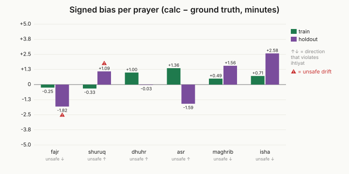

# Progress

_This file is auto-generated by `npm run build:charts`. Do not edit by hand._

Latest run: `2026-05-06T03:22:33.294Z`
Previous:   `2026-05-06T02:03:32.392Z`

## Headline

| Metric | Value | Δ since previous |
|---|---:|---:|
| Train WMAE (ratchet) | 0.9757 | +0.00 |
| Holdout WMAE (test)  | 7.3599 | -0.96 |
| Train entries        | 215 | |
| Holdout entries      | 29004 | |

## Per-prayer (train)

| Prayer | MAE (min) | Signed bias | Notes |
|---|---:|---:|---|
| fajr | 1.20 | -0.25 |  |
| shuruq | 0.60 | -0.33 |  |
| dhuhr | 1.03 | +1.00 |  |
| asr | 1.53 | +1.36 |  |
| maghrib | 0.66 | +0.49 |  |
| isha | 0.80 | +0.71 |  |

## Per-source agreement

Lower WMAE = better agreement with that institution's tables.

### Train (ratchet)

| Source | Entries | WMAE | Fajr bias | Maghrib bias | Isha bias |
|---|---:|---:|---:|---:|---:|
| JAKIM (via waktusolat.app) | 30 | 0.45 | -0.73 | -0.03 | -0.10 |
| Diyanet İşleri Başkanlığı (Türkiye) | 30 | 0.50 | +0.33 | +0.10 | +0.57 |
| Mawaqit (mosque-published) | 25 | 0.88 | +0.64 | +0.04 | +0.28 |
| Aladhan API | 130 | 1.22 | -0.45 | +0.79 | +1.02 |

### Holdout (test, diagnostic only)

| Source | Entries | WMAE | Fajr bias | Maghrib bias | Isha bias |
|---|---:|---:|---:|---:|---:|
| MUIS (Majlis Ugama Islam Singapura) | 365 | 0.45 | -0.16 | -0.27 | -0.22 |
| Aladhan (Institute of Geophysics, U. Tehran proxy) | 1825 | 0.59 | +0.48 | +0.48 | +0.50 |
| Aladhan (University of Islamic Sciences, Karachi proxy) | 1825 | 0.72 | +0.48 | +0.50 | +0.50 |
| Ministry of Habous and Islamic Affairs (Morocco) | 990 | 1.26 | +0.98 | -0.17 | +0.48 |
| Habous | 12 | 1.37 | +1.33 | +0.42 | +0.67 |
| Aladhan (Islamic Society of the UK) | 1095 | 1.84 | +0.47 | +3.47 | +0.48 |
| KEMENAG (Kementerian Agama Republik Indonesia) | 1054 | 2.27 | -1.78 | -2.85 | -1.98 |
| praytimes.org reference (Hamid Zarrabi-Zadeh, LGPL v3.0) | 100 | 3.56 | +4.95 | +0.05 | -5.40 |
| Aladhan API | 1263 | 4.58 | -1.99 | +0.07 | -0.24 |
| KEMENAG (Kementerian Agama Republik Indonesia) via myQuran | 147 | 6.81 | +0.90 | +2.33 | +3.41 |
| Mawaqit (mosque-published) | 20296 | 9.72 | +3.98 | +6.84 | +3.66 |
| muslimsalat.com (third-party aggregator) | 32 | 26.09 | +30.13 | +12.22 | -3.28 |

## Per-region (train)

| Region | Entries | WMAE | Fajr bias | Maghrib bias | Isha bias |
|---|---:|---:|---:|---:|---:|
| Shah Alam | 10 | 0.29 | -0.20 | +0.10 | +0.10 |
| Sale | 1 | 0.36 | -1.00 | +0.00 | +0.00 |
| Agadir | 1 | 0.36 | +0.00 | +0.00 | +1.00 |
| Ankara | 10 | 0.48 | +0.30 | +0.00 | +0.60 |
| George Town | 10 | 0.49 | -1.00 | +0.30 | +0.20 |
| Istanbul | 10 | 0.50 | +0.30 | +0.00 | +0.70 |
| Meknes | 1 | 0.50 | +0.00 | +0.00 | +1.00 |
| Izmir | 10 | 0.53 | +0.40 | +0.30 | +0.40 |
| Marrakech | 1 | 0.57 | +0.00 | -1.00 | +0.00 |
| Kuala Lumpur | 10 | 0.59 | -1.00 | -0.50 | -0.60 |
| Jakarta | 10 | 0.63 | +0.40 | +0.40 | +0.40 |
| Casablanca | 3 | 0.69 | +0.33 | +0.67 | +0.67 |
| Makkah | 10 | 0.71 | +1.00 | +0.30 | +0.30 |
| Paris | 10 | 0.75 | +0.50 | +0.50 | +0.60 |
| Los Angeles | 10 | 0.78 | +0.50 | +0.30 | +0.60 |
| Dubai | 10 | 0.79 | +0.70 | +0.50 | +0.50 |
| Safi | 1 | 0.79 | +0.00 | +1.00 | +1.00 |
| Madinah | 10 | 0.81 | +0.50 | +0.60 | +0.60 |
| Fes | 2 | 0.82 | +1.50 | +0.00 | +0.00 |
| Taza | 1 | 0.86 | +1.00 | -2.00 | +1.00 |
| Essaouira | 1 | 0.93 | +0.00 | +2.00 | +1.00 |
| Karachi | 10 | 0.94 | +0.60 | +0.50 | +0.60 |
| Toronto | 10 | 0.94 | +0.50 | +0.50 | +0.50 |
| Riyadh | 10 | 0.94 | +0.90 | +0.90 | +0.90 |
| Khouribga | 1 | 1.00 | +0.00 | -1.00 | +0.00 |
| Taroudant | 1 | 1.00 | -1.00 | -1.00 | -1.00 |
| Ouarzazate | 2 | 1.00 | +0.50 | -1.00 | +0.50 |
| Errachidia | 1 | 1.00 | -1.00 | -2.00 | -1.00 |
| Tanger | 2 | 1.04 | +1.50 | +2.00 | +0.00 |
| New York | 10 | 1.04 | +0.60 | +0.70 | +0.90 |
| Oujda | 2 | 1.11 | +1.00 | -1.00 | +0.50 |
| Rabat | 1 | 1.14 | +3.00 | +1.00 | +1.00 |
| Kenitra | 1 | 1.14 | +1.00 | +1.00 | +1.00 |
| Nador | 1 | 1.21 | +3.00 | +2.00 | +0.00 |
| Settat | 1 | 1.21 | +1.00 | -1.00 | -2.00 |
| London | 10 | 2.16 | +1.10 | +3.60 | +0.90 |
| Alexandria | 10 | 2.69 | -6.80 | +0.70 | +3.00 |
| Cairo | 10 | 2.74 | -6.30 | +0.80 | +3.40 |

## Trend (last 10 runs)

| Timestamp | Train WMAE | Holdout WMAE |
|---|---:|---:|
| 2026-05-05T22:49:59.854Z | 0.9757 | 8.4809 |
| 2026-05-05T22:50:06.810Z | 0.9757 | 8.4809 |
| 2026-05-05T22:50:11.152Z | 0.9757 | 8.4809 |
| 2026-05-05T22:50:16.720Z | 0.9757 | 8.4809 |
| 2026-05-05T22:51:44.771Z | 0.9757 | 8.4809 |
| 2026-05-05T22:52:43.550Z | 0.9757 | 8.3248 |
| 2026-05-06T01:19:23.959Z | 0.9757 | 8.3248 |
| 2026-05-06T01:25:41.291Z | 0.9757 | 8.3248 |
| 2026-05-06T02:03:32.392Z | 0.9757 | 8.3248 |
| 2026-05-06T03:22:33.294Z | 0.9757 | 7.3599 |

## Charts

